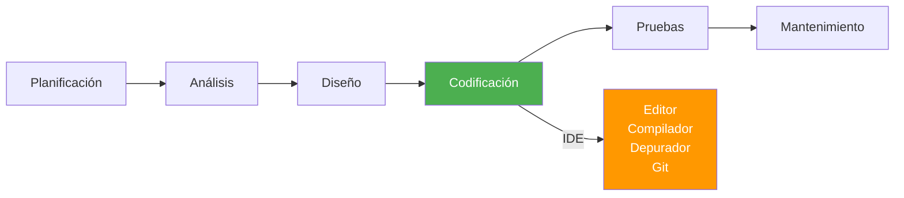
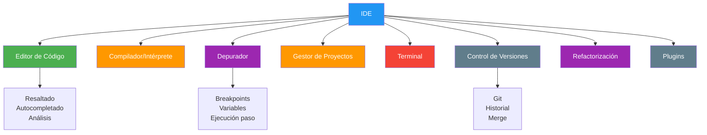
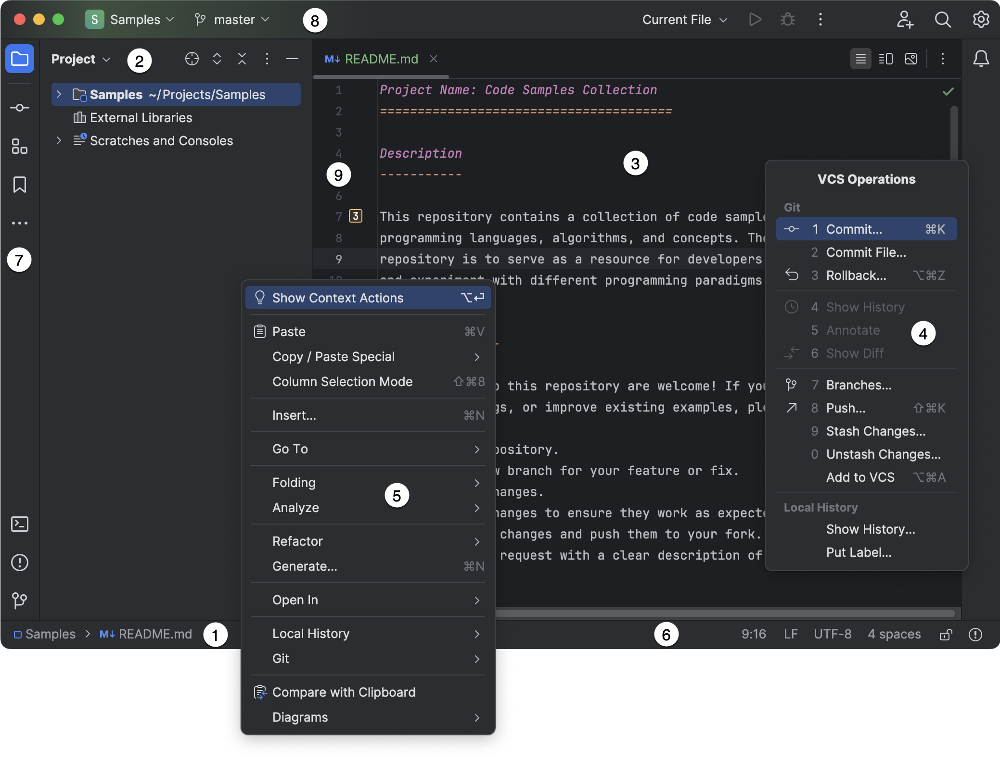
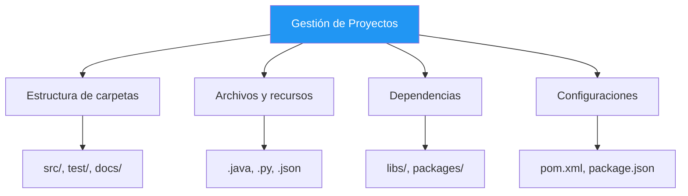

- [1. Introducción a los Entornos de Desarrollo Integrados (IDE)](#1-introducción-a-los-entornos-de-desarrollo-integrados-ide)
  - [1.1. Concepto y rol del IDE en la codificación](#11-concepto-y-rol-del-ide-en-la-codificación)
    - [Rol en el Ciclo de Vida del Software](#rol-en-el-ciclo-de-vida-del-software)
    - [Clasificación básica](#clasificación-básica)
  - [1.2. Componentes esenciales del IDE y su función](#12-componentes-esenciales-del-ide-y-su-función)
    - [1.2.1. Editor de código fuente (Resaltado, autocompletado, analizadores)](#121-editor-de-código-fuente-resaltado-autocompletado-analizadores)
    - [1.2.2. Compilador/Intérprete (Traducción a código máquina)](#122-compiladorintérprete-traducción-a-código-máquina)
    - [1.2.3. Depurador (Debugger) (Puntos de ruptura, examen de variables)](#123-depurador-debugger-puntos-de-ruptura-examen-de-variables)
    - [1.2.4. Gestión de proyectos o fichecheros (Explorador de archivos o Soluciones)](#124-gestión-de-proyectos-o-fichecheros-explorador-de-archivos-o-soluciones)
    - [1.2.5. Terminal integrado](#125-terminal-integrado)
    - [1.2.6. Control de Versiones](#126-control-de-versiones)
    - [1.2.7. Herramientas de Refactorización (Mejora de Código)](#127-herramientas-de-refactorización-mejora-de-código)
    - [1.2.8. Plugins y Complementos (Modularidad)](#128-plugins-y-complementos-modularidad)


> 💡 **Punto de partida:** ¿Alguna vez te has preguntado por qué un programador puede crear una aplicación completa en horas mientras que otro tarda días con la misma tarea? La diferencia no es solo el talento: es la herramienta que usa.

> 💡 **¿Por qué me importa?**
> Porque el IDE es tu herramienta de trabajo diario. Dominarlo es como un carpintero dominar sus herramientas: marca la diferencia entre ser rápido y eficiente o frustrarse y cometer errores.
> 
> 🔗 **Conexión con otros puntos:** El Punto 02 verás cómo instalar estas herramientas. El Punto 03 profundizará en su anatomía. El Punto 05 enseñará a usarlas en la práctica.

**Objetivos de aprendizaje:**

- Definir qué es un IDE y sus componentes esenciales
- Identificar las diferencias entre IDEs monolenguaje, políglota y especializado
- Conocer las herramientas integradas en un IDE moderno
- Reconocer la importancia del IDE en el ciclo de vida del software

# 1. Introducción a los Entornos de Desarrollo Integrados (IDE)

## 1.1. Concepto y rol del IDE en la codificación

Un **Entorno de Desarrollo Integrado (IDE)** (*Integrated Development Environment*) es una aplicación informática diseñada para **facilitar la tarea al programador**, ayudando a desarrollar aplicaciones con mayor rapidez. Un IDE se define como un conjunto de procedimientos y herramientas que facilitan la labor del desarrollo de aplicaciones.

> 💡 **Analogía:** Un IDE es como un taller mecánico especializado. En lugar de tener herramientas sueltas (llave inglesa, destornillador, etc.) dispersas por todo el garage, tienes un taller completo con todo organizado: elevador, herramientas específicas para cada tipo de reparación, manuales técnicos a mano, etc. Todo está integrado para que el mecánico trabaje más rápido y con menos errores.

### Rol en el Ciclo de Vida del Software

Los entornos de desarrollo se utilizan fundamentalmente en la **fase de codificación** del ciclo de vida del software, independientemente del modelo de desarrollo que se utilice. La utilización de un IDE permite desarrollar el proyecto de software de una forma mucho más ágil.



> 📝 **Nota del Profesor:** Aunque el IDE se usa principalmente en codificación, las herramientas integradas (control de versiones, gestión de proyectos, testing) tocan todas las fases. Por ejemplo, el control de versiones acompaña al proyecto desde el primer día hasta el mantenimiento.

### Clasificación básica

Existen entornos de desarrollo diseñados para un **solo lenguaje** o para **múltiples lenguajes**. Con el tiempo, algunos IDEs se han vuelto más generales, abarcando diversos lenguajes y tipos de aplicaciones.

| Tipo | Ejemplos | Características |
|------|----------|-----------------|
| **IDE monolenguaje** | PyCharm (Python), PhpStorm (PHP) | Optimizado para un solo lenguaje |
| **IDE políglota** | IntelliJ IDEA (Java, Kotlin, SQL...), VS Code | Soporta múltiples lenguajes |
| **IDE especializado** | Android Studio, Xcode | Para plataformas específicas |

**IDE que usaremos en el curso:**

| IDE | Lenguajes principales | Ventajas |
|-----|----------------------|----------|
| **JetBrains Rider** | C#, .NET | Multiplataforma, muy rápido |
| **IntelliJ IDEA** | Java, Kotlin, Scala | El mejor para Java, análisis de código excelente |
| **VS Code** | JavaScript, Python, Java, C++... | Ligero, extensible, gratis |

> 📌 **Ejemplo real:** Microsoft utiliza Rider como IDE principal para el desarrollo de herramientas internas de Azure y .NET. Stack Overflow, una de las comunidades más grandes para desarrolladores, también usa tecnologías .NET con Rider para su backend.

> 📌 **Ejemplo real:** GitHub desarrolló Codespaces sobre VS Code, ofreciendo entornos de desarrollo en la nube. Microsoft lo usa internamente para el desarrollo de Azure y herramientas de VS.

> 📌 **Ejemplo real:** El banco BBVA utiliza Eclipse para el desarrollo de aplicaciones bancarias en Java. La Agencia Espacial europea (ESA) también lo usa para sistemas de control de misiones.

> 💡 **Dato profesional:** Según la encuesta de Stack Overflow 2025, VS Code es el editor más usado (73%), seguido de IntelliJ IDEA (26%). En entornos empresariales .NET/C#, Rider está creciendo rápidamente. Conocer varios IDEs te hace más polivalente en el mercado laboral. En este curso, Rider será nuestro IDE principal de JetBrains.

## 1.2. Componentes esenciales del IDE y su función

Un entorno de desarrollo está compuesto por distintas herramientas integradas que ayudan durante todo el proceso de creación del código fuente. Algunas de estas herramientas son:





### 1.2.1. Editor de código fuente (Resaltado, autocompletado, analizadores)

El editor de código es la herramienta principal que permite escribir y modificar el código fuente del programa. Sus funciones clave incluyen:

- **Resaltado de sintaxis:** Muestra de forma visual las palabras reservadas según el lenguaje de programación utilizado.

> 💡 **Ejemplo visual:**
> ```csharp
> // Resaltado de sintaxis en C#
> Console.WriteLine("¡Hola Mundo!");
> ```
> Las palabras `Console` y `WriteLine` aparecen en un color diferente, haciendo el código más legible.

- **Autocompletado de código:** Ofrece sugerencias que ayudan a completar el código. En el contexto de VS Code, esto se conoce como **IntelliSense**.

> 📝 **Dato curioso:** IntelliSense es una marca registrada de Microsoft. Otros IDEs tienen sistemas similares pero con nombres diferentes: "Code Completion" en IntelliJ, "Kite" como extensión, etc.

- **Análisis de código:** Incluye un **analizador léxico** (que corrige palabras mal escritas) y un **analizador sintáctico** (que informa si la estructura está bien realizada).

> 📝 **Error típico de estudiante:** "El IDE me marca error pero el código está bien". A veces el IDE no ha actualizado su índice o hay problemas de caché. Reiniciar el IDE suele solucionar estos falsos positivos.

- Otras utilidades: Identificación automática de código, e inserción automática de paréntesis, corchetes, tabulaciones y espaciados.

### 1.2.2. Compilador/Intérprete (Traducción a código máquina)

Los IDEs integran las herramientas necesarias para traducir el código fuente.

- **Compilador:** Es la herramienta encargada de traducir el código fuente escrito en un lenguaje a código legible para las máquinas (código binario o código máquina).

> 💡 **Analogía:** El compilador es como un traductor profesional que traduce un libro completo de inglés a español antes de publicarlo. La traducción lleva tiempo, pero una vez publicada, la lectura es rápida.

- **Intérprete:** Su misión es similar al compilador, traduciendo el código fuente a código máquina línea a línea a medida que se va ejecutando, siendo generalmente más lento.

> 💡 **Analogía:** El intérprete es como un traductor simultáneo que traduce mientras hablas. La traducción es más lenta pero inmediata, sin esperar a terminar todo el discurso.

- Los IDEs permiten **compilar o interpretar** el código fuente en un formato ejecutable o en *bytecode*, y algunos ofrecen la capacidad de **ejecutar el código** directamente desde el entorno.

### 1.2.3. Depurador (Debugger) (Puntos de ruptura, examen de variables)

El depurador es una herramienta fundamental que permite probar y eliminar posibles errores, facilitando un desarrollo más eficiente.

- **Puntos de ruptura (*Breakpoints*):** Permite detener la ejecución del programa en puntos específicos que el desarrollador desee.

> 💡 **Ejemplo práctico:** Imagina que tu programa falla cuando procesa el elemento 50 de una lista de 100. En lugar de añadir 50 prints, pones un breakpoint al inicio del bucle y ejecutas paso a paso hasta llegar al elemento 50.

- **Ejecución controlada:** Permite ejecutar el código línea a línea (paso a paso), avanzando o retrasando la ejecución.

| Comando | Función |
|---------|---------|
| **Step Over** | Ejecuta la línea actual y pasa a la siguiente |
| **Step Into** | Entra dentro de la función llamada |
| **Step Out** | Sale de la función actual y vuelve al llamante |

- **Inspección y modificación de variables:** Permite examinar el estado y el valor actual de las variables en el momento de la ejecución. Es posible modificar el valor de las variables sobre la marcha y continuar la ejecución.

> 📝 **Truco profesional:** Durante la depuración, puedes cambiar el valor de una variable para probar diferentes escenarios sin modificar el código fuente. Útil para probar casos límite.

### 1.2.4. Gestión de proyectos o fichecheros (Explorador de archivos o Soluciones)

Esta herramienta permite crear, organizar y administrar proyectos de software, incluyendo la gestión de directorios, archivos y dependencias.

- En el contexto de los IDEs, esto se manifiesta en ventanas como el **Explorador** (*Explorer*) en VS Code o la ventana **Proyecto** (*Project tool window*) en IntelliJ IDEA o **Explorador de Soluciones** (*Solution Explorer*) en JetBrains Rider.



### 1.2.5. Terminal integrado

Los IDEs suelen ofrecer integración con herramientas externas a través de una terminal.

- En los IDEs JetBrains (Rider e IntelliJ IDEA), se puede acceder a la ventana de herramientas de la **Terminal** (*Terminal tool window*) mediante el atajo de teclado **Alt+F12**.
- Visual Studio Code (VS Code) cuenta con una **terminal integrada** a la que se accede mediante **Ctrl+`** (Windows, Linux).

> 💡 **Ventaja:** La terminal integrada tiene el mismo contexto que tu proyecto. Si estás en la carpeta `/projects/miapp`, la terminal ya abre ahí. No necesitas navegar con `cd`.

### 1.2.6. Control de Versiones

Es una herramienta que permite al desarrollador controlar los **distintos cambios que sufre el código** de una aplicación a lo largo de su construcción.

- Algunos IDEs incluyen **integración con sistemas de control de versiones** como Git, permitiendo realizar el seguimiento de cambios, realizar confirmaciones (*commits*), y fusionar (*merge*) ramas.
- **VS Code** incluye **soporte nativo para Git**.


> 📝 **Nota del Profesor:** Git es esencial en el desarrollo moderno. Desde el primer día de prácticas profesionales tendréis que usar Git. Practicad los comandos básicos: add, commit, push, pull, branch, merge.

### 1.2.7. Herramientas de Refactorización (Mejora de Código)

La refactorización es la parte del mantenimiento del código que busca **mejorar la facilidad de comprensión** sin alterar su funcionalidad externa.

- Los IDEs suelen incluir herramientas específicas para la refactorización, como renombrar variables, extraer métodos, y reorganizar el código.
- Estas herramientas ayudan a mantener el código limpio y eficiente, facilitando su mantenimiento y evolución.

> 💡 **Ejemplo de refactorización:**
> ```csharp
> // Antes: código duplicado
> double precio1 = cantidad1 * precioUnitario1;
> double precio2 = cantidad2 * precioUnitario2;
> double precio3 = cantidad3 * precioUnitario3;
>
> // Después: extraer método
> double precio1 = CalcularPrecio(cantidad1, precioUnitario1);
> double precio2 = CalcularPrecio(cantidad2, precioUnitario2);
> double precio3 = CalcularPrecio(cantidad3, precioUnitario3);
> ```

### 1.2.8. Plugins y Complementos (Modularidad)

Los *plugins* o complementos son aplicaciones adicionales que se relacionan con otras herramientas para agregarles una función nueva y generalmente muy específica.

- Esta aplicación adicional es ejecutada por la aplicación principal.
- Los IDEs permiten la instalación de extensiones o *plugins* que añaden nuevas funcionalidades: soporte para nuevos lenguajes, herramientas de análisis de código, integración con servicios externos, temas visuales, entre otros.

| IDE | Marketplace | Plugins instalados |
|-----|-------------|-------------------|
| IntelliJ IDEA | JetBrains Marketplace | Lombok, Key Promoter X |
| VS Code | VS Code Marketplace | Python, Prettier, GitLens |
| Rider | JetBrains Marketplace | Unity, Unreal support |

> 📝 **Recomendación:** No instaléis demasiados plugins. Cada uno consume recursos y puede ralentizar el IDE. Instalad solo los que uséis diariamente.

---

**Resumen del punto:**

| Concepto | Descripción |
|----------|-------------|
| **IDE** | Entorno que integra editor, compilador, depurador y herramientas |
| **Editor** | Resaltado, autocompletado, análisis de código |
| **Compilador** | Traduce código fuente a código máquina |
| **Depurador** | Permite ejecutar paso a paso y examinar variables |
| **Control de versiones** | Git integrado para seguimiento de cambios |
| **Refactorización** | Mejora el código sin cambiar su comportamiento |
| **Plugins** | Extensiones que añaden funcionalidades al IDE |

En el siguiente punto veremos cómo instalar todos estos componentes en tu ordenador, desde los kits de desarrollo hasta los propios IDEs.
