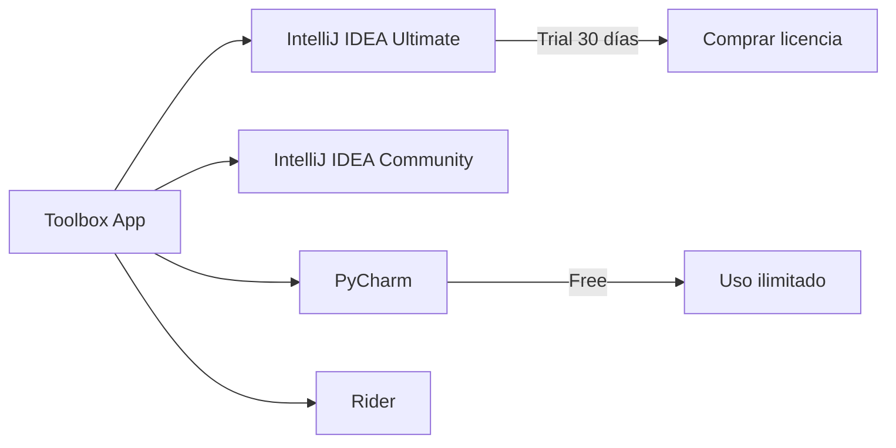
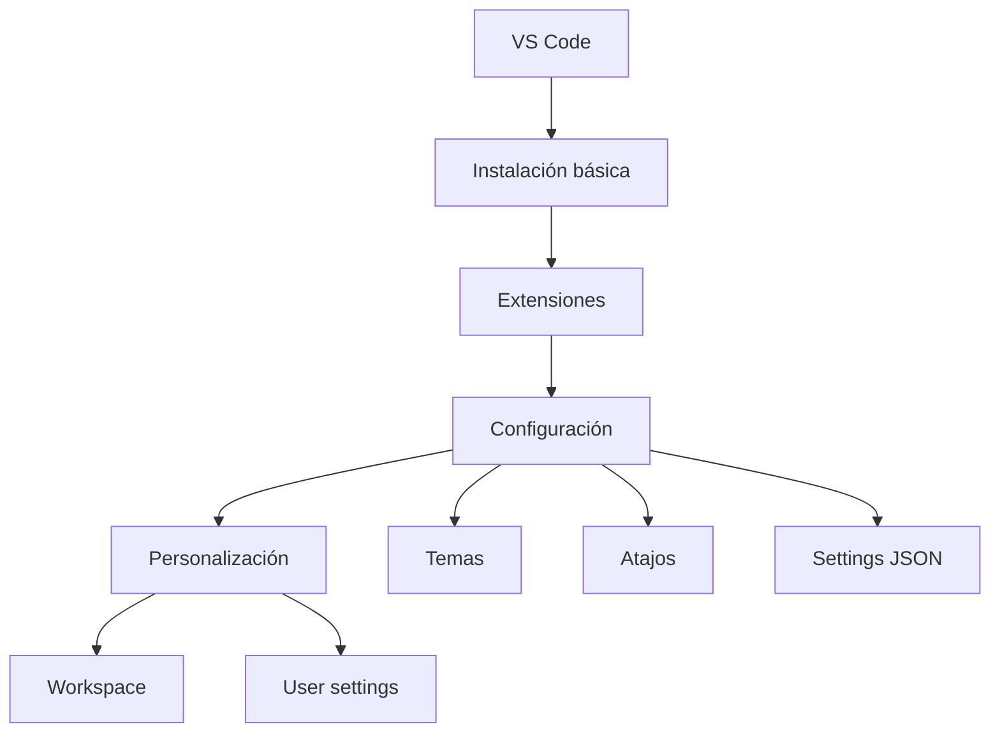
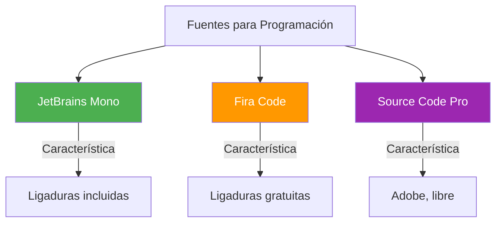

- [2. Instalación de Herramientas Fundamentales para el Curso](#2-instalación-de-herramientas-fundamentales-para-el-curso)
  - [2.1. Kits de Desarrollo](#21-kits-de-desarrollo)
    - [2.1.1. Instalación de JDK 25 (Java Development Kit)](#211-instalación-de-jdk-25-java-development-kit)
    - [2.1.2. Instalación de .NET 10 (SDK/Runtime)](#212-instalación-de-net-10-sdkruntime)
  - [2.2. Instalación de Entornos Integrados de Desarrollo (IDE)](#22-instalación-de-entornos-integrados-de-desarrollo-ide)
    - [2.2.1. Instalación de JetBrains Rider (JetBrains)](#221-instalación-de-jetbrains-rider-jetbrains)
    - [2.2.2. Instalación de IntelliJ IDEA (JetBrains)](#222-instalación-de-intellij-idea-jetbrains)
    - [2.2.3. Instalación de Visual Studio Code (VS Code)](#223-instalación-de-visual-studio-code-vs-code)
  - [2.3. Instalación de Herramientas de Control de Versiones](#23-instalación-de-herramientas-de-control-de-versiones)
    - [2.3.1. Instalación de Git](#231-instalación-de-git)
    - [2.3.2. Instalación de GitKraken](#232-instalación-de-gitkraken)
  - [2.4. Instalación de fuentes adicionales](#24-instalación-de-fuentes-adicionales)
  - [2.5. Instalación de terminal Oh My Posh (Desarrollador)](#25-instalación-de-terminal-oh-my-posh-desarrollador)
  - [2.6. Creación de Proyectos y Soluciones en C#](#26-creación-de-proyectos-y-soluciones-en-c)


# 2. Instalación de Herramientas Fundamentales para el Curso

> 💡 **Punto de partida:** Tienes el mejor coche del mundo, pero si no tienes motor, no va a ningún lado. Los IDEs son el coche, pero necesitas instalar los motores (JDK, .NET SDK) primero.

> 💡 **¿Por qué me importa?**
> Sin las herramientas correctamente instaladas, no puedes ni empezar a programar. Un JDK mal configurado puede costarte horas de debugging frustrante. Instalar bien es el primer paso para desarrollar bien.
> 
> 🔗 **Conexión con otros puntos:** El Punto 01 explicó qué son los IDEs. Este punto los instala. El Punto 04 verás cómo personalizarlos. El Punto 06 los atajos para usarlos más rápido.

En el Punto 01 vimos qué es un IDE y sus componentes principales. Ahora veremos cómo instalar las herramientas necesarias para empezar a programar: kits de desarrollo, IDEs, control de versiones y utilidades adicionales.

**Objetivos de aprendizaje:**

- Instalar JDK 25 y verificar su funcionamiento
- Instalar .NET 10 SDK y configurar el entorno
- Instalar y configurar JetBrains Rider, IntelliJ IDEA y VS Code
- Instalar Git y GitKraken
- Crear soluciones y proyectos en C# con dotnet CLI
- Configurar NuGet y gestionar paquetes

Esta sección describe los procesos de instalación de los componentes esenciales, enfocándose en los requisitos y los métodos de instalación de los IDEs JetBrains y VS Code.

## 2.1. Kits de Desarrollo

Los Kits de Desarrollo son plataformas base que el IDE utiliza para compilar y ejecutar el código escrito.

> 💡 **Analogía:** El JDK o .NET SDK es como el motor del coche. El IDE (IntelliJ, VS Code) es el tablero de control y los volantes. Sin motor, el tablero no sirve de nada.

### 2.1.1. Instalación de JDK 25 (Java Development Kit)

La instalación del **JDK (Java Development Kit)** es un paso previo fundamental, ya que es la plataforma del entorno.

- **Función del JDK:** El JDK es el kit necesario para **desarrollar programas**. Consiste en la plataforma del entorno que permite que el IDE sea instalado y ejecutado.
- **Componentes:** Incluye la **Máquina Virtual de Java (JVM)** y la **biblioteca estándar** necesaria para la ejecución, así como herramientas clave para el desarrollo, como `javac`, `jar` y `javadoc`.

```bash
# Comandos JDK que usarás en el curso
javac HolaMundo.java    # Compilar
java HolaMundo          # Ejecutar
jar cf miapp.jar *.class  # Empaquetar
javadoc *.java          # Generar documentación
```

- Para ejecutar IntelliJ IDEA, no es necesario instalar Java por separado, ya que **JetBrains Runtime está incluido** (*bundled*) con el IDE (basado en JBR 25), pero para desarrollar aplicaciones Java, se requiere un **JDK** (*standalone*).

> 📝 **Nota del Profesor:** Para desarrollo Java profesional, usad siempre JDK (no JRE). El JRE solo permite ejecutar Java, el JDK permite compilar. En el curso usaremos **JDK 25** (la versión LTS más reciente).

**Métodos de instalación del JDK:**

| Método | Ventajas | Desventajas |
|--------|----------|-------------|
| **Instalador oficial Oracle** | Oficial, garantizado | Requiere cuenta Oracle |
| **OpenJDK (Adoptium)** | Libre, open source | Actualizaciones manuales |
| **SDKMAN!** (Linux/Mac) | Gestiona versiones múltiples | Solo terminal |
| **Chocolatey/winget** (Windows) | Fácil actualización | Gestor adicional |

### 2.1.2. Instalación de .NET 10 (SDK/Runtime)

La instalación de este SDK es un requisito fundamental para el desarrollo de proyectos en el ecosistema **.NET** (C#, F#). Este SDK es especialmente relevante para **JetBrains Rider**, ya que es el IDE que se centra en el desarrollo de soluciones .NET.

```bash
# Comandos .NET que usarás en el curso
dotnet new console -n MiApp          # Crear proyecto
dotnet build                         # Compilar
dotnet run                           # Ejecutar
dotnet test                          # Ejecutar pruebas
```

> 📝 **Dato importante:** El SDK incluye el Runtime, así que con instalar el SDK tienes todo lo necesario para desarrollar y ejecutar.

**Versiones de .NET:**
- **.NET 10:** LTS (soportado hasta noviembre 2028)
- **.NET 11:** Preview (2026)

## 2.2. Instalación de Entornos Integrados de Desarrollo (IDE)

### 2.2.1. Instalación de JetBrains Rider (JetBrains)

JetBrains Rider es un IDE *cross-platform* que proporciona una experiencia consistente en Windows, macOS y Linux. Su instalación también ofrece múltiples métodos.

**Métodos de Instalación:**

1. **Toolbox App (Recomendado):** Similar a IntelliJ IDEA.
   - **Pasos Post-Instalación (Windows):** Después de la instalación mediante *Toolbox App*, un diálogo permite instalar el **JetBrains ETW Service** (necesario para *Performance profiling* y DPA) y **añadir los ejecutables de Rider a las exclusiones de Windows Defender** para mejorar el tiempo de arranque.

2. **Instalación Standalone (Manual):** Permite configurar accesos directos, añadir *launchers* al *PATH*, asociar extensiones y las mismas opciones de instalación de servicios y exclusiones de Windows Defender que la *Toolbox App*.

3. **Instalación Silenciosa (Windows):** Se realiza sin interfaz, utilizando *switches* como `/S` y archivos de configuración.

4. **Snap Package (Linux):** Disponible, pero se recomienda la *Toolbox App* para una experiencia más fluida.

```bash
# Instalación en Ubuntu/Debian
sudo snap install rider --classic
```

> 💡 **Rider es nuestro IDE principal:** En este curso de DAW, usaremos Rider como IDE principal de JetBrains para desarrollo en C#/.NET. Es multiplataforma (Windows, Linux, macOS) y ofrece todas las capacidades de IntelliJ adaptadas al ecosistema .NET.

### 2.2.2. Instalación de IntelliJ IDEA (JetBrains)

IntelliJ IDEA está disponible en **Community Edition** (libre y *open-source*) y **Ultimate** (comercial, con *trial* de 30 días). Es un IDE multiplataforma (Windows, Linux y Mac OS).

**Métodos de Instalación:**

1. **Toolbox App (Recomendado):** Es la herramienta recomendada por JetBrains para instalar y gestionar diferentes productos o varias versiones del mismo (incluyendo EAP y *Nightly releases*), actualizar o retroceder, y eliminar fácilmente. La *Toolbox App* también mantiene una lista de todos los proyectos para abrirlos rápidamente en la versión correcta.



2. **Instalación Standalone (Manual):** Permite gestionar manualmente la ubicación de la instalación y los archivos de configuración.
   - **Opciones en Windows (Standalone):** Durante la instalación asistida, se puede configurar: crear un acceso directo, añadir los *launchers* de línea de comandos al *PATH*, añadir la acción **Open Folder as Project** al menú contextual del sistema, y asociar extensiones de archivo (ej. `.java`) con IntelliJ IDEA.

3. **Instalación Silenciosa (Windows):** Se realiza sin interfaz gráfica, utilizando *switches* como `/S` (habilitar instalación silenciosa) y especificando el path de instalación `/D`.

```batch
:: Instalación silenciosa de IntelliJ
ideaIC-2024.3.1.exe /S /D=C:\Program Files\JetBrains\IntelliJ
```

4. **Snap Package (Linux):** IntelliJ IDEA puede instalarse como paquete *snap* (auto-actualizable), aunque JetBrains recomienda usar la *Toolbox App* si se experimentan problemas de rendimiento o *debugging*.

```bash
# Instalación en Ubuntu/Debian
sudo snap install intellij-idea-community --classic
```

> 📝 **Recomendación:** Para estudiantes, usad la **Community Edition** (gratis). Para el curso de DAW es más que suficiente. Si queréis probar Ultimate, hay licencia gratuita para estudiantes (mediante GitHub Student Pack).

> 📝 **Nota:** IntelliJ IDEA es el IDE que usaremos para proyectos Java/Kotlin cuando sea necesario. Es secundario en este curso, pero es bueno conocerlo porque comparte la misma filosofía y atajos que Rider.

### 2.2.3. Instalación de Visual Studio Code (VS Code)

Visual Studio Code es un IDE ligero y altamente personalizable, multiplataforma (Windows, Linux y Mac OS).

- VS Code se descarga desde su página oficial (https://code.visualstudio.com).
- La instalación requiere descargar y ejecutar el paquete para iniciar el proceso.



> 📝 **Ventajas de VS Code:**
> - Gratuito y open source
> - Extremadamente ligero (arranque en segundos)
> - Miles de extensiones gratuitas
> - Integración excelente con Git
> - Multiplataforma (Windows, Mac, Linux)

**Extensiones esenciales para el curso:**

| Extensión | Funcionalidad |
|-----------|---------------|
| **Extension Pack for Java** | Soporte Java, depuración, Maven/Gradle |
| **C#** | Soporte C#, .NET, debugging |
| **ReSharper** | Análisis de código C#, refactorización, code smells |

### ReSharper para VS Code

**JetBrains ReSharper** es una extensión de JetBrains para VS Code que aporta las capacidades de análisis de código de los IDEs JetBrains al editor de Microsoft. Es la versión ligera de ReSharper Ultimate, diseñada específicamente para VS Code.

**¿Qué hace ReSharper?**

- **Análisis de código en tiempo real:** Detecta errores, code smells (código problemático) y sugiere mejoras mientras escribes.
- **Refactorizaciones potentes:** Renombrar, extraer métodos, cambiar firmas, y decenas de refactorizaciones automáticas.
- **Quick Fixes:** Correcciones automáticas con un clic (el icono del bombillo).
- **Navigation:** Ir a declaraciones, implementaciones, usos de un símbolo.
- **Code cleanup:** Formateo y limpieza automática de código según reglas de estilo.

**Instalación:**

1. Abre VS Code
2. Ve a la vista Extensiones (`Ctrl+Shift+X`)
3. Busca "ReSharper"
4. Selecciona **JetBrains ReSharper** y pulsa **Install**
5. Reinicia VS Code si es necesario

> 📝 **ReSharper vs C# Dev Kit:** Ambas extensiones son complementarias. C# Dev Kit proporciona la estructura de proyecto (Solution Explorer, test runner), mientras ReSharper se centra en el análisis de código y refactorizaciones. Puedes usar las dos juntas.

**Comandos habituales de ReSharper en VS Code:**

| Comando | Atajo | Descripción |
|---------|-------|-------------|
| **Quick Fix** | `Alt+Enter` | Correcciones y sugerencias |
| **Refactor** | `Ctrl+Shift+R` | Menú de refactorizaciones |
| **Go to Implementation** | `Ctrl+F12` | Ir a la implementación de una interfaz |
| **Find Usages** | `Shift+F12` | Buscar todos los usos de un símbolo |
| **Code Cleanup** | `Ctrl+Shift+F9` | Limpiar y formatear código |

> 💡 **Consejo:** Si usas Rider para C#, no necesitas ReSharper en VS Code (Rider ya incluye todo). ReSharper es ideal cuando prefieres VS Code como editor principal pero quieres las capacidades de análisis de JetBrains.

> 📝 **ReSharper para VS Code:** JetBrains ofrece ReSharper como extensión para VS Code. Proporciona análisis de código avanzado, detección de code smells y refactorizaciones potentes para C#. Se instala desde el marketplace de VS Code buscando "ReSharper".

## 2.3. Instalación de Herramientas de Control de Versiones

### 2.3.1. Instalación de Git

**Git** es una herramienta esencial que permite al desarrollador controlar los **distintos cambios** que sufre el código.

- Es fundamental tener Git instalado, ya que **VS Code incluye soporte Git integrado** de fábrica. La vista de Control de Código Fuente en VS Code puede indicar si Git no está detectado y ofrecer un botón para instalarlo.

```bash
# Comandos Git básicos del curso
git init                  # Inicializar repositorio
git add .                 # Preparar cambios
git commit -m "mensaje"   # Confirmar cambios
git push                  # Subir a remoto
git pull                  # Descargar cambios
git status                # Ver estado
git log                   # Ver historial
```

> 💡 **Dato:** Git fue creado por Linus Torvalds en 2005 para desarrollar el kernel Linux. Hoy es el sistema de control de versiones más usado del mundo.

**Instalación según SO:**

| SO | Método |
|----|--------|
| **Windows** | https://git-scm.com/download/win |
| **macOS** | `brew install git` o instalador oficial |
| **Linux** | `sudo apt install git` (Debian/Ubuntu) |

### 2.3.2. Instalación de GitKraken

GitKraken es un cliente Git popular que se utilizará en el curso. Permite gestionar visualmente repositorios y ramas de manera más intuitiva.

> 💡 **Ventaja de GitKraken:** Esencial para entender visualmente cómo funcionan las ramas y los merges. Mucho más intuitivo que la línea de comandos para principiantes.

**Versiones:**
- **Gratuita:** Para repositorios públicos y repositorios privados limitados
- **Pro:** Para repositorios privados ilimitados (gratuito para estudiantes con GitHub Student Pack)

## 2.4. Instalación de fuentes adicionales

Para mejorar la experiencia visual y de lectura del código, se recomienda instalar fuentes adicionales como **Fira Code** o **JetBrains Mono** y activar el soporte para **ligaduras (ligatures)** en los IDEs.



> 📝 **¿Qué son las ligaduras?** Son combinaciones de caracteres. Por ejemplo, `!=` puede aparecer como `≠` o `=>` como `⇒`. Esto hace el código más legible.

**Instalación de JetBrains Mono:**
1. Descargar desde https://www.jetbrains.com/es-es/mono/
2. Instalar en el sistema operativo
3. Configurar en el IDE: Settings → Font → JetBrains Mono

## 2.5. Instalación de terminal Oh My Posh (Desarrollador)

**Oh My Posh** es una herramienta que permite personalizar la terminal de comandos, proporcionando un entorno visualmente atractivo y funcional.

- Se recomienda su instalación para mejorar la experiencia en la terminal integrada de los IDEs y en la línea de comandos del sistema operativo.
- La instalación puede realizarse mediante gestores de paquetes como `winget` en Windows o `brew` en macOS, o siguiendo las instrucciones oficiales en su página de GitHub.

```bash
# Instalación en Windows
winget install JanDeDobbeleer.OhMyPosh

# Instalación en macOS
brew install oh-my-posh

# Instalación en Linux
curl -s https://ohmyposh.dev/install.sh | bash -s
```

> 💡 **Visual de Oh My Posh:**
> ```
> ✦ ~ master → on branch master
> ❯ cd projects/miapp
> ✦ ~/projects/miApp main → git status
> ```

> 📝 **Nota del Profesor:** Oh My Posh es opcional pero muy recomendable. Hace que la terminal sea más agradable y muestra información útil (git branch, tiempo de ejecución de comandos, etc.).

## 2.6. Creación de Proyectos y Soluciones en C#

Una vez instaladas las herramientas, necesitas saber cómo crear la estructura de un proyecto en C#. En .NET, la organización sigue una jerarquía: **solución → proyecto → código**.

> 💡 **Analogía:** Una solución es como un libro. Los proyectos son los capítulos. Cada capítulo tiene sus propios archivos, pero todos forman parte del mismo libro.

### Estructura de una Solución

Una **solución** (*solution*) agrupa uno o más proyectos relacionados. En .NET 10, el formato por defecto es `.slnx` (basado en XML):

```xml
<Solution>
  <Project Path="MiProyecto/MiProyecto.csproj" />
</Solution>
```

### Estructura de un Proyecto

Un **proyecto** se define en un archivo `.csproj`:

```xml
<Project Sdk="Microsoft.NET.Sdk">
  <PropertyGroup>
    <OutputType>Exe</OutputType>
    <TargetFramework>net10.0</TargetFramework>
    <ImplicitUsings>enable</ImplicitUsings>
    <Nullable>enable</Nullable>
    <TreatWarningsAsErrors>true</TreatWarningsAsErrors>
    <LangVersion>14</LangVersion>
  </PropertyGroup>
</Project>
```

| Propiedad | Descripción | Valor |
|-----------|-------------|-------|
| `OutputType` | Tipo de salida | `Exe` (ejecutable) o `Library` (biblioteca) |
| `TargetFramework` | Framework objetivo | `net10.0` |
| `ImplicitUsings` | Usings implícitos | `enable` |
| `Nullable` | Gestión estricta de nulos | `enable` |
| `LangVersion` | Versión de C# | `14` para .NET 10 |

### Crear una Solución con dotnet CLI

```bash
# 1. Crear carpeta raíz
mkdir MiSolucion
cd MiSolucion

# 2. Crear la solución (.slnx)
dotnet new sln

# 3. Crear el proyecto de consola
dotnet new console -n MiProyecto

# 4. Añadir el proyecto a la solución
dotnet sln add MiProyecto/MiProyecto.csproj

# 5. Compilar y ejecutar
dotnet build
dotnet run --project MiProyecto
```

> 📝 **Nota:** En .NET 10, `dotnet new console` genera código con Top Level Statements. No necesitas `class Program` ni `static void Main()`.

### Gestión de Paquetes NuGet

**NuGet** es el gestor de paquetes de .NET (más de 350.000 bibliotecas).

```bash
# Instalar un paquete
dotnet add package Newtonsoft.Json

# Versión específica
dotnet add package Newtonsoft.Json --version 13.0.3

# Eliminar un paquete
dotnet remove package Newtonsoft.Json

# Ver paquetes instalados
dotnet list package
```

**Configuración de NuGet** (`~/.nuget/NuGet/NuGet.Config`):

```xml
<?xml version="1.0" encoding="utf-8"?>
<configuration>
  <packageSources>
    <add key="nuget.org" value="https://api.nuget.org/v3/index.json" protocolVersion="3" />
  </packageSources>
</configuration>
```

| Paquete | Uso |
|---------|-----|
| **Newtonsoft.Json** | Serialización JSON |
| **Microsoft.EntityFrameworkCore** | ORM para bases de datos |
| **Serilog** | Logging estructurado |
| **NUnit** | Framework de tests |

### Compilar y Ejecutar

```bash
dotnet build           # Compilar
dotnet run             # Ejecutar
dotnet clean           # Limpiar
dotnet restore         # Restaurar paquetes
dotnet publish -c Release -o ./publish  # Publicar ejecutable
```

> 📝 **Nota:** Los archivos compilados se generan en `bin/Debug/net10.0/`. El archivo `.dll` es el ensamblado .NET, y `.exe` es el ejecutable en Windows.

---

**Resumen del punto:**

| Herramienta | Función | Comando clave |
|-------------|---------|---------------|
| **JDK 25** | Desarrollo Java | `javac`, `java` |
| **.NET 10 SDK** | Desarrollo C# | `dotnet new`, `dotnet run` |
| **IntelliJ IDEA** | IDE para Java/Kotlin | Community (gratis) |
| **JetBrains Rider** | IDE para C#/.NET | Multiplataforma |
| **VS Code** | Editor extensible | Gratuito, ligero |
| **Git** | Control de versiones | `git commit`, `git push` |
| **GitKraken** | Cliente Git visual | UI gráfica |
| **NuGet** | Gestor de paquetes .NET | `dotnet add package` |

En el siguiente punto veremos la anatomía de estos IDEs: qué hay dentro de cada uno, para qué sirve cada parte y cómo se organizan las herramientas.
