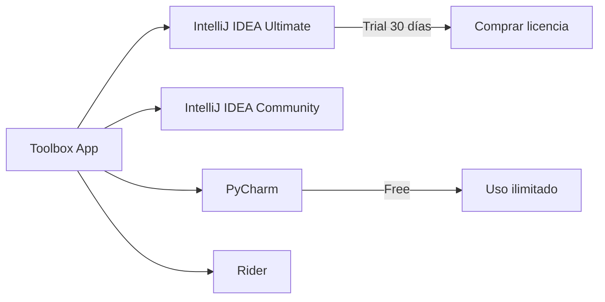
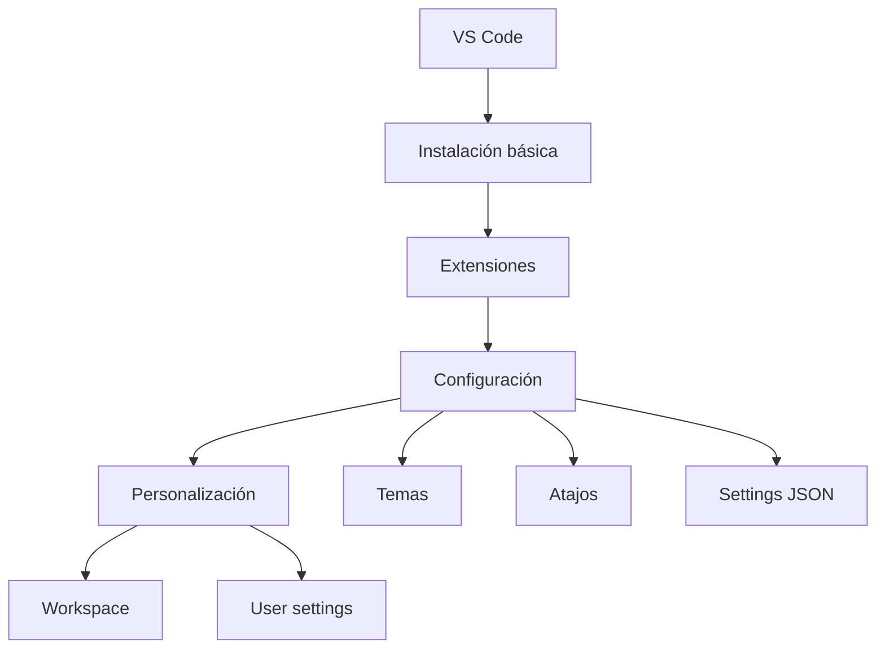
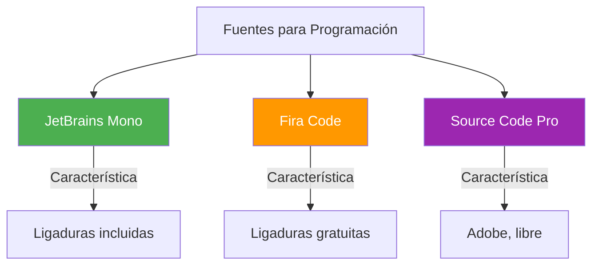

- [2. Instalación de Herramientas Fundamentales para el Curso](#2-instalación-de-herramientas-fundamentales-para-el-curso)
  - [2.1. Kits de Desarrollo](#21-kits-de-desarrollo)
    - [2.1.1. Instalación de JDK 21 (Java Development Kit)](#211-instalación-de-jdk-21-java-development-kit)
    - [2.1.2. Instalación de .NET 8 (SDK/Runtime)](#212-instalación-de-net-8-sdkruntime)
  - [2.2. Instalación de Entornos Integrados de Desarrollo (IDE)](#22-instalación-de-entornos-integrados-de-desarrollo-ide)
    - [2.2.1. Instalación de IntelliJ IDEA (JetBrains)](#221-instalación-de-intellij-idea-jetbrains)
    - [2.2.2. Instalación de JetBrains Rider (JetBrains)](#222-instalación-de-jetbrains-rider-jetbrains)
    - [2.2.3. Instalación de Visual Studio Code (VS Code)](#223-instalación-de-visual-studio-code-vs-code)
  - [2.3. Instalación de Herramientas de Control de Versiones](#23-instalación-de-herramientas-de-control-de-versiones)
    - [2.3.1. Instalación de Git](#231-instalación-de-git)
    - [2.3.2. Instalación de GitKraken](#232-instalación-de-gitkraken)
  - [2.4. Instalación de fuentes adicionales](#24-instalación-de-fuentes-adicionales)
  - [2.5. Instalación de terminal Oh My Posh (Desarrollador)](#25-instalación-de-terminal-oh-my-posh-desarrollador)


> 💡 **Punto de partida:** Tienes el mejor coche del mundo, pero si no tienes motor, no va a ningún lado. Los IDEs son el coche, pero necesitas instalar los motores (JDK, .NET SDK) primero.

> 💡 **¿Por qué me importa?**
> Sin las herramientas correctamente instaladas, no puedes ni empezar a programar. Un JDK mal configurado puede costarte horas de debugging frustrante. Instalar bien es el primer paso para desarrollar bien.
> 
> 🔗 **Conexión con otros puntos:** El Punto 01 explicó qué son los IDEs. Este punto los instala. El Punto 04 verás cómo personalizarlos. El Punto 06 los atajos para usarlos más rápido.

# 2. Instalación de Herramientas Fundamentales para el Curso

Esta sección describe los procesos de instalación de los componentes esenciales, enfocándose en los requisitos y los métodos de instalación de los IDEs JetBrains y VS Code.

## 2.1. Kits de Desarrollo

Los Kits de Desarrollo son plataformas base que el IDE utiliza para compilar y ejecutar el código escrito.

> 💡 ** Analogía:** El JDK o .NET SDK es como el motor del coche. El IDE (IntelliJ, VS Code) es el tablero de control y los volanteг. Sin motor, el tablero no sirve de nada.

### 2.1.1. Instalación de JDK 21 (Java Development Kit)

La instalación del **JDK (Java Development Kit)** es un paso previo fundamental, ya que es la plataforma del entorno.

- **Función del JDK:** El JDK es el kit necesario para **desarrollar programas**. Consiste en la plataforma del entorno que permite que el IDE sea instalado y ejecutado.
- **Componentes:** Incluye la **Máquina Virtual de Java (JVM)** y la **biblioteca estándar** necesaria para la ejecución, así como herramientas clave para el desarrollo, como `javac`, `jar` y `javadoc`.

```bash
# Comandos JDK que usarás en el curso
javac HolaMundo.java    # Compilar
java HolaMundo          # Ejecutar
jar cf miapp.jar *.class  # Empaquetar
javadoc *.java          # Generar documentación
```

- Para ejecutar IntelliJ IDEA, no es necesario instalar Java por separado, ya que **JetBrains Runtime está incluido** (*bundled*) con el IDE (basado en JBR 21), pero para desarrollar aplicaciones Java, se requiere un **JDK** (*standalone*).

> 📝 ** Nota del Profesor:** Para desarrollo Java profesional, usad siempre JDK (no JRE). El JRE solo permite ejecutar Java, el JDK permite compilar. En el curso usaremos **JDK 21** (la versión LTS más reciente).

**Métodos de instalación del JDK:**

| Método | Ventajas | Desventajas |
|--------|----------|-------------|
| **Instalador oficial Oracle** | Oficial, garantizado | Requiere cuenta Oracle |
| **OpenJDK (Adoptium)** | Libre, open source | Actualizaciones manuales |
| **SDKMAN!** (Linux/Mac) | Gestiona versiones múltiples | Solo terminal |
| **Chocolatey/winget** (Windows) | Fácil actualización | Gestor adicional |

### 2.1.2. Instalación de .NET 8 (SDK/Runtime)

La instalación de este SDK es un requisito fundamental para el desarrollo de proyectos en el ecosistema **.NET** (C#, F#). Este SDK es especialmente relevante para **JetBrains Rider**, ya que es el IDE que se centra en el desarrollo de soluciones .NET.

```bash
# Comandos .NET que usarás en el curso
dotnet new console -n MiApp          # Crear proyecto
dotnet build                         # Compilar
dotnet run                           # Ejecutar
dotnet test                          # Ejecutar pruebas
```

> 📝 ** Dato importante:** El SDK incluye el Runtime, así que con instalar el SDK tienes todo lo necesario para desarrollar y ejecutar.

**Versiones de .NET:**
- **.NET 6:** LTS hasta noviembre 2024 (ya no soportada)
- **.NET 8:** LTS hasta noviembre 2026 (recomendada)
- **.NET 9:** Latest, sin LTS (para experimentar)

## 2.2. Instalación de Entornos Integrados de Desarrollo (IDE)

### 2.2.1. Instalación de IntelliJ IDEA (JetBrains)

IntelliJ IDEA está disponible en **Community Edition** (libre y *open-source*) y **Ultimate** (comercial, con *trial* de 30 días). Es un IDE multiplataforma (Windows, Linux y Mac OS).

**Métodos de Instalación:**

1. **Toolbox App (Recomendado):** Es la herramienta recomendada por JetBrains para instalar y gestionar diferentes productos o varias versiones del mismo (incluyendo EAP y *Nightly releases*), actualizar o retroceder, y eliminar fácilmente. La *Toolbox App* también mantiene una lista de todos los proyectos para abrirlos rápidamente en la versión correcta.



2. **Instalación Standalone (Manual):** Permite gestionar manualmente la ubicación de la instalación y los archivos de configuración.
   - **Opciones en Windows (Standalone):** Durante la instalación asistida, se puede configurar: crear un acceso directo, añadir los *launchers* de línea de comandos al *PATH*, añadir la acción **Open Folder as Project** al menú contextual del sistema, y asociar extensiones de archivo (ej. `.java`) con IntelliJ IDEA.

3. **Instalación Silenciosa (Windows):** Se realiza sin interfaz gráfica, utilizando *switches* como `/S` (habilitar instalación silenciosa) y especificando el path de instalación `/D`.

```batch
:: Instalación silenciosa de IntelliJ
ideaIC-2024.3.1.exe /S /D=C:\Program Files\JetBrains\IntelliJ
```

4. **Snap Package (Linux):** IntelliJ IDEA puede instalarse como paquete *snap* (auto-actualizable), aunque JetBrains recomienda usar la *Toolbox App* si se experimentan problemas de rendimiento o *debugging*.

```bash
# Instalación en Ubuntu/Debian
sudo snap install intellij-idea-community --classic
```

> 📝 ** Recomendación:** Para estudiantes, usad la **Community Edition** (gratis). Para el curso de DAW es más que suficiente. Si queréis probar Ultimate, hay licencia gratuita para estudiantes (mediante GitHub Student Pack).

### 2.2.2. Instalación de JetBrains Rider (JetBrains)

JetBrains Rider es un IDE *cross-platform* que proporciona una experiencia consistente en Windows, macOS y Linux. Su instalación también ofrece múltiples métodos.

**Métodos de Instalación:**

1. **Toolbox App (Recomendado):** Similar a IntelliJ IDEA.
   - **Pasos Post-Instalación (Windows):** Después de la instalación mediante *Toolbox App*, un diálogo permite instalar el **JetBrains ETW Service** (necesario para *Performance profiling* y DPA) y **añadir los ejecutables de Rider a las exclusiones de Windows Defender** para mejorar el tiempo de arranque.

2. **Instalación Standalone (Manual):** Permite configurar accesos directos, añadir *launchers* al *PATH*, asociar extensiones y las mismas opciones de instalación de servicios y exclusiones de Windows Defender que la *Toolbox App*.

3. **Instalación Silenciosa (Windows):** Se realiza sin interfaz, utilizando *switches* como `/S` y archivos de configuración.

4. **Snap Package (Linux):** Disponible, pero se recomienda la *Toolbox App* para una experiencia más fluida.

```bash
# Instalación en Ubuntu/Debian
sudo snap install rider --classic
```

> 💡 ** ¿Cuándo usar Rider?** Rider es ideal para desarrollo C#/.NET en entornos no-Windows (Linux/Mac). Si usas Windows, Visual Studio también es excelente. Para el curso de DAW, usaremos Rider para consistencia multiplataforma.

### 2.2.3. Instalación de Visual Studio Code (VS Code)

Visual Studio Code es un IDE ligero y altamente personalizable, multiplataforma (Windows, Linux y Mac OS).

- VS Code se descarga desde su página oficial (https://code.visualstudio.com).
- La instalación requiere descargar y ejecutar el paquete para iniciar el proceso.



> 📝 ** Ventajas de VS Code:**
> - Gratuito y open source
> - Extremadamente ligero (arranque en segundos)
> - Miles de extensiones gratuitas
> - Integración excelente con Git
> - Multiplataforma (Windows, Mac, Linux)

**Extensiones esenciales para el curso:**

| Extensión | Funcionalidad |
|-----------|---------------|
| **Extension Pack for Java** | Soporte Java, depuración, Maven/Gradle |
| **C#** | Soporte C#, .NET, debugging |
| **Python** | Soporte Python, IntelliSense, linting |
| **Prettier** | Formateo automático de código |
| **GitLens** | Visualización avanzada de Git |
| **Live Server** | Servidor web para desarrollo |

## 2.3. Instalación de Herramientas de Control de Versiones

### 2.3.1. Instalación de Git

**Git** es una herramienta esencial que permite al desarrollador controlar los **distintos cambios** que sufre el código.

- Es fundamental tener Git instalado, ya que **VS Code incluye soporte Git integrado** de fábrica. La vista de Control de Código Fuente en VS Code puede indicar si Git no está detectado y ofrecer un botón para instalarlo.

```bash
# Comandos Git básicos del curso
git init                  # Inicializar repositorio
git add .                 # Preparar cambios
git commit -m "mensaje"   # Confirmar cambios
git push                  # Subir a remoto
git pull                  # Descargar cambios
git status                # Ver estado
git log                   # Ver historial
```

> 💡 ** Dato:** Git fue creado por Linus Torvalds en 2005 para desarrollar el kernel Linux. Hoy es el sistema de control de versiones más usado del mundo.

**Instalación según SO:**

| SO | Método |
|----|--------|
| **Windows** | https://git-scm.com/download/win |
| **macOS** | `brew install git` o instalador oficial |
| **Linux** | `sudo apt install git` (Debian/Ubuntu) |

### 2.3.2. Instalación de GitKraken

GitKraken es un cliente Git popular que se utilizará en el curso. Permite gestionar visualmente repositorios y ramas de manera más intuitiva.

> 💡 ** Ventaja de GitKraken:** Esencial para entender visualmente cómo funcionan las ramas y los merges. Mucho más intuitivo que la línea de comandos para principiantes.

**Versiones:**
- **Gratuita:** Para repositorios públicos y repositorios privados limitados
- **Pro:** Para repositorios privados ilimitados (gratuito para estudiantes con GitHub Student Pack)

## 2.4. Instalación de fuentes adicionales

Para mejorar la experiencia visual y de lectura del código, se recomienda instalar fuentes adicionales como **Fira Code** o **JetBrains Mono** y activar el soporte para **ligaduras (ligatures)** en los IDEs.



> 📝 ** ¿Qué son las ligaduras?** Son combinaciones de caracteres. Por ejemplo, `!=` puede aparecer como `≠` o `=>` como `⇒`. Esto hace el código más legible.

**Instalación de JetBrains Mono:**
1. Descargar desde https://www.jetbrains.com/es-es/mono/
2. Instalar en el sistema operativo
3. Configurar en el IDE: Settings → Font → JetBrains Mono

## 2.5. Instalación de terminal Oh My Posh (Desarrollador)

**Oh My Posh** es una herramienta que permite personalizar la terminal de comandos, proporcionando un entorno visualmente atractivo y funcional.

- Se recomienda su instalación para mejorar la experiencia en la terminal integrada de los IDEs y en la línea de comandos del sistema operativo.
- La instalación puede realizarse mediante gestores de paquetes como `winget` en Windows o `brew` en macOS, o siguiendo las instrucciones oficiales en su página de GitHub.

```bash
# Instalación en Windows
winget install JanDeDobbeleer.OhMyPosh

# Instalación en macOS
brew install oh-my-posh

# Instalación en Linux
curl -s https://ohmyposh.dev/install.sh | bash -s
```

> 💡 ** Visual de Oh My Posh:**
> ```
> ✦ ~ master → on branch master
> ❯ cd projects/miapp
> ✦ ~/projects/miApp main → git status
> ```

> 📝 ** Nota del Profesor:** Oh My Posh es opcional pero muy recomendable. Hace que la terminal sea más agradable y muestra información útil (git branch, tiempo de ejecución de comandos, etc.).

---

> 🔗 **Siguiente:** En el Punto 03 profundizarás en la anatomía de los IDEs que acabas de instalar.
