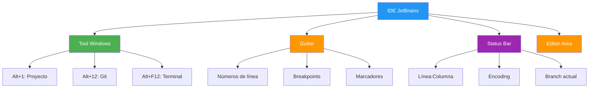
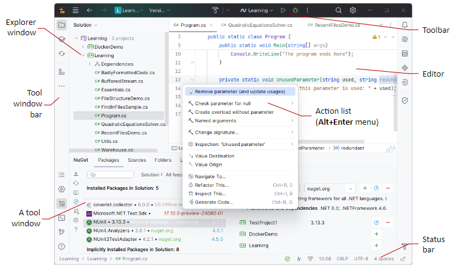
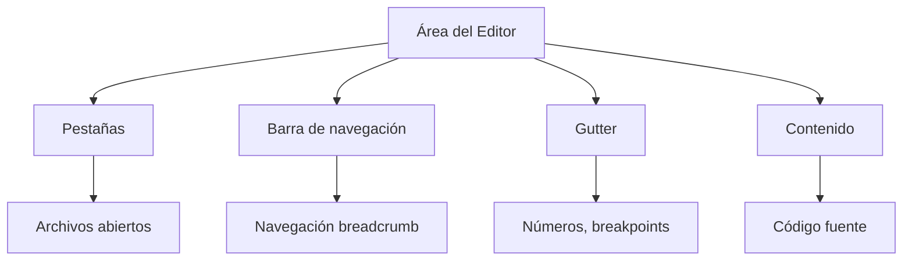
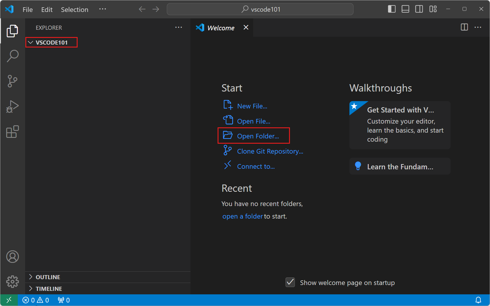
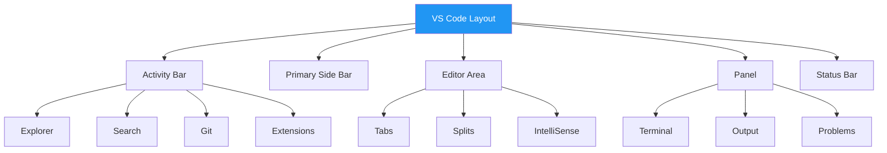

- [3. Anatomía y Estructura de los IDEs Seleccionados](#3-anatomía-y-estructura-de-los-ides-seleccionados)
  - [3.1. Filosofía JetBrains: Uniformidad de Flujo de Trabajo](#31-filosofía-jetbrains-uniformidad-de-flujo-de-trabajo)
    - [3.1.1. Consistencia de la Interfaz (IntelliJ IDEA y Rider)](#311-consistencia-de-la-interfaz-intellij-idea-y-rider)
    - [3.1.2. Uso de la Terminal integrada](#312-uso-de-la-terminal-integrada)
  - [3.2. Estructura de IntelliJ IDEA y JetBrains Rider](#32-estructura-de-intellij-idea-y-jetbrains-rider)
  - [3.3. Estructura de Visual Studio Code (VS Code)](#33-estructura-de-visual-studio-code-vs-code)


> 💡 **Punto de partida:** Si nunca has abierto el capó de un coche, no sabes qué hay dentro. Lo mismo pasa con un IDE: saber qué hay y para qué sirve cada cosa te convierte en un usuario más eficiente.

> 💡 **¿Por qué me importa?**
> Conocer la anatomía del IDE te permite aprovechar al máximo sus funcionalidades. Es como conocer cada botón del volante: puedes manejar sin ellos, pero es mucho más cómodo y rápido con ellos.
> 
> 🔗 **Conexión con otros puntos:** El Punto 01 introdujo los componentes. Este punto los detalla visualmente. El Punto 05 enseñará a usarlos en la práctica diaria.

# 3. Anatomía y Estructura de los IDEs Seleccionados

## 3.1. Filosofía JetBrains: Uniformidad de Flujo de Trabajo

Una característica notable al utilizar IDEs del mismo fabricante, como **IntelliJ IDEA** y **JetBrains Rider**, es la **consistencia de la interfaz** y la **familiaridad del flujo de trabajo**. Esto facilita la transición entre entornos diseñados para diferentes plataformas (Java en IDEA, .NET en Rider).

> 💡 **Ventaja de usar productos JetBrains:** Si aprendes IntelliJ IDEA, aprender Rider es muy fácil. Los atajos, la estructura de menús y la filosofía son idénticas. Tu inversión en aprender una herramienta se transfiere a otras.

### 3.1.1. Consistencia de la Interfaz (IntelliJ IDEA y Rider)

Ambos IDEs comparten una filosofía de diseño basada en:



- **Ventanas de Herramientas (*Tool Windows*):** Proporcionan funcionalidades complementarias a la edición de código. Por defecto, están acopladas a los lados y al fondo de la ventana principal. Se puede acceder a ellas mediante la barra de iconos laterales o atajos de teclado. Por ejemplo, **Alt+1** abre la ventana de Proyecto/Solución, y **F12** salta desde el editor a la última *Tool Window* activa.

| Atajo | Ventana | Función |
|-------|---------|---------|
| `Alt + 1` | Proyecto | Ver estructura del proyecto |
| `Alt + 2` | Favoritos | Marcadores y breakpoints |
| `Alt + 9` | Git | Control de versiones |
| `Alt + 12` | Database | Base de datos |
| `Alt + F12` | Terminal | Línea de comandos |

- **Gutter:** El panel a la izquierda del editor contiene **iconos de acción** para corregir problemas de código, ejecutar o depurar. También muestra **números de línea, puntos de ruptura (*breakpoints*)** y **marcadores** (*bookmarks*). Permite el plegado de código y marca las líneas modificadas bajo control de versiones.

> 📝 **Partes del Gutter:**
> ```
>  1 | package com.ejemplo;
>  2 |              ← Icono de acción (bombilla)
>  3 | public class Main {
>  4 |     // TODO: implementar
>  5 |     ••••           ← Breakpoint
>  6 |     public static void main(String[] args) {
>  7 |         System.out.println("Hola");
>  8 |     }
>  9 | }
> ```

- **Barra de Estado (*Status Bar*):** Se encuentra en la parte inferior de la ventana principal.
  - **Mensajes:** En el lado izquierdo, muestra mensajes de eventos recientes y el progreso de las tareas en segundo plano (*Background Tasks*).
  - **Widgets:** En el lado derecho, contiene *widgets* que indican el estado general del proyecto y del IDE. Ejemplos incluyen el número de línea y columna (ej. `52:11`), terminaciones de línea (LF o CRLF), codificación de archivo (UTF-8), y el estilo de sangría (ej. `2 spaces`). Rider también incluye *widgets* para el estado del análisis de la solución y el Análisis Dinámico de Programas (DPA).

### 3.1.2. Uso de la Terminal integrada

La Terminal integrada se presenta como una *Tool Window*.

- El acceso rápido a la Terminal integrada se puede realizar mediante el atajo de teclado **Alt+F12** en ambos IDEs de JetBrains.

```bash
# Comandos útiles en la terminal integrada
cd /ruta/al/proyecto          # Navegar
ls -la                        # Listar archivos
./mvnw clean install          # Maven wrapper
dotnet build                  # .NET build
git status                    # Ver cambios
```

> 💡 **Truco:** La terminal integrada hereda el PATH del sistema, pero también puedes configurarla para usar diferentes shells (PowerShell, CMD, WSL, bash).

## 3.2. Estructura de IntelliJ IDEA y JetBrains Rider

Ambos IDEs comparten elementos de navegación y control en el encabezado (Nueva UI):




- **Área del Editor (*Editor*):** Es la zona central para leer, escribir y explorar el código fuente.



- **Barra de Navegación (*Navigation Bar*):** Se puede mostrar en la parte superior del IDE o en la barra de estado. Es una alternativa a la vista de Proyecto/Solución para navegar por la estructura del proyecto y saltar a elementos específicos del código. Se accede usando **Alt+Home**.

> 📝 **Uso de la barra de navegación:**
> ```
> com.ejemplo.Main → main() → Variables
> ```
> Permite saltar rápidamente a cualquier clase, método o variable.

- **Barra de Herramientas (*Toolbar*):** Ubicada en el encabezado de la ventana, contiene *widgets* importantes:

| Widget | Icono | Función |
|--------|-------|---------|
| **Project Widget** | 📂 | Abrir proyectos, cambiar entre recientes |
| **VCS Widget** | 🔀 | Rama actual, commit, push, pull |
| **Run Widget** | ▶️ | Ejecutar configuración actual |
| **Build Widget** | 🔨 | Compilar proyecto (Rider) |

## 3.3. Estructura de Visual Studio Code (VS Code)

VS Code es un IDE/editor ligero que organiza el trabajo en torno a un *workspace* (espacio de trabajo), generalmente la carpeta raíz del proyecto.





- **Barra de Actividad (*Activity Bar*):** Barra vertical en el extremo izquierdo utilizada para **cambiar entre las diferentes vistas** principales, como el Explorador, Control de Código Fuente y Extensiones. Al pasar el ratón por encima se puede ver el nombre de cada vista y su atajo de teclado.

| Vista | Atajo | Función |
|-------|-------|---------|
| Explorer | `Ctrl+Shift+E` | Explorador de archivos |
| Search | `Ctrl+Shift+F` | Búsqueda global |
| Source Control | `Ctrl+Shift+G` | Git integrado |
| Run and Debug | `Ctrl+Shift+D` | Depuración |
| Extensions | `Ctrl+Shift+X` | Marketplace |

- **Vista de Explorador (*Explorer View*) (Gestor de Ficheros):** Al seleccionarla, se abre la **barra lateral principal (*Primary Side Bar*)** y permite **ver y administrar los archivos y carpetas** dentro del *workspace*.

- **Área del Editor (*Editor*):** Área principal de la ventana para leer, escribir y explorar el código. Permite la edición en múltiples pestañas y visualización lado a lado. Muestra sugerencias de autocompletado (*IntelliSense*) y **resaltado de sintaxis**.

> 💡 **Atajos esenciales del editor VS Code:**
> ```
> Ctrl + P         → Quick Open (buscar archivo)
> Ctrl + Shift + P → Command Palette
> Ctrl + B         → Toggle Sidebar
> Ctrl + `         → Toggle Terminal
> Ctrl + Shift + M → Problems panel
> ```

- **Panel Inferior (*Panel*) y Terminal Integrado:** El panel inferior incluye la **terminal integrada**, cuyo acceso se logra mediante **Ctrl+`** (Windows, Linux).

> 📝 **Configuración de terminal en VS Code:**
> ```
> Ctrl + , → Settings → Terminal → Integrated
> ```

- **Paleta de Comandos (*Command Palette*):** Herramienta central de navegación y ejecución.
  - Se accede mediante **Ctrl+Shift+P** (Windows, Linux).
  - Permite buscar y ejecutar comandos (ej. `move terminal`).
  - Al quitar el símbolo `>` de la paleta, se puede usar directamente para **buscar archivos** en el *workspace*. Utiliza la **coincidencia difusa** (*fuzzy matching*) para encontrar comandos o archivos.

> 💡 **Fuzzy matching ejemplo:** Si buscas "jre", encontrará "JavaRuntimeEnvironment" porque las letras coinciden en orden.

- **Guardado y Hot Exit:** Por defecto, VS Code requiere una acción explícita para guardar (`Ctrl+S`). Sin embargo, se puede activar el **Auto Save** para guardar después de un retardo (por defecto 1000 ms), al perder el foco del editor, o al perder el foco de la ventana. VS Code también recuerda los cambios no guardados al salir (*Hot Exit*).

| Configuración | Valor | Descripción |
|---------------|-------|-------------|
| `files.autoSave` | `off` | Manual (por defecto) |
| `files.autoSave` | `afterDelay` | Auto después de X ms |
| `files.autoSave` | `onFocusChange` | Al cambiar de pestaña |
| `files.autoSave` | `onWindowChange` | Al cambiar de ventana |

> 📝 **Recomendación:** Para principiantes, mantener `off` es mejor para entender el flujo de trabajo. Para productividad, `afterDelay` de 1000ms es ideal.

---

> 🔗 **Siguiente:** En el Punto 04 aprenderás a personalizar y configurar estos IDEs.
