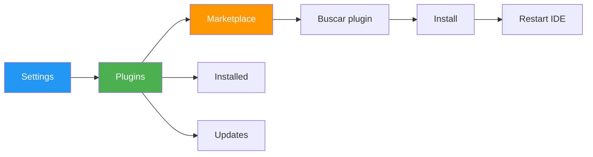
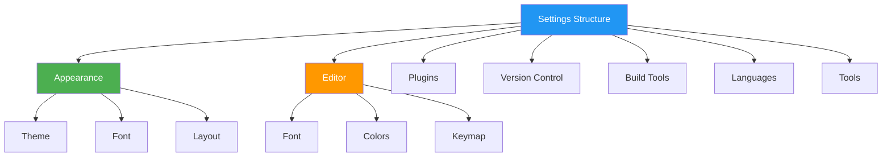

- [4. Plugins, Configuración y Personalización del Entorno](#4-plugins-configuración-y-personalización-del-entorno)
  - [4.1. Gestión de Plugins y Extensiones (Modularidad)](#41-gestión-de-plugins-y-extensiones-modularidad)
    - [4.1.1. Gestión en IntelliJ IDEA y JetBrains Rider (JetBrains)](#411-gestión-en-intellij-idea-y-jetbrains-rider-jetbrains)
    - [4.1.2. Gestión en Visual Studio Code (VS Code)](#412-gestión-en-visual-studio-code-vs-code)
  - [4.2. Personalización Visual y de Uso](#42-personalización-visual-y-de-uso)
      - [4.2.1. Acceso a la Configuración General](#421-acceso-a-la-configuración-general)
      - [4.2.2. Temas, Apariencia y Configuración de Archivos](#422-temas-apariencia-y-configuración-de-archivos)
      - [4.2.3. Configuraciones Específicas del Proyecto (VS Code)](#423-configuraciones-específicas-del-proyecto-vs-code)
      - [4.2.4. Refactorización (Mejora de Código)](#424-refactorización-mejora-de-código)
  - [4.3. Actualización y Mantenimiento del Entorno](#43-actualización-y-mantenimiento-del-entorno)


> 💡 **Punto de partida:** ¿Por qué dos programadores con el mismo IDE pueden tener experiencias tan diferentes? Porque uno personaliza su entorno y el otro no.

> 💡 **¿Por qué me importa?**
> Un IDE bien configurado se adapta a tu forma de trabajar y te ahorra tiempo. Los plugins correctos pueden duplicar tu productividad. La personalización no es un lujo: es una inversión en eficiencia.
> 
> 🔗 **Conexión con otros puntos:** El Punto 02 instalaste las herramientas. Este punto las personalizas. El Punto 04.3 verás cómo mantenerlas actualizadas.

# 4. Plugins, Configuración y Personalización del Entorno

La personalización es vital, ya que el programador pasa mucho tiempo en el entorno, que debe ser agradable y disponer de todas las funcionalidades necesarias. Todo entorno de desarrollo dispone de un panel donde se puede cambiar la configuración, incluyendo el aspecto visual, las conexiones de red y la asignación de teclas.

> 💡 ** Analogía:** Un IDE es como tu puesto de trabajo. Puedes mover los monitores, organizar los cajones, poner una foto en el escritorio... Lo importante es que estés cómodo y productivo.

## 4.1. Gestión de Plugins y Extensiones (Modularidad)

Un *plugin* es un complemento que agrega una función nueva y específica a la aplicación principal.

### 4.1.1. Gestión en IntelliJ IDEA y JetBrains Rider (JetBrains)

Los IDEs de JetBrains utilizan *plugins* para ampliar sus capacidades.

- **Acceso al gestor:** Se realiza desde **`File -> Settings`** o utilizando el atajo **Ctrl+Alt+S**.



- **Instalación:** Dentro de la sección *Plugins*, se hace clic en *Install JetBrains plugins* para realizar búsquedas por nombre o categoría. Tras la instalación, es necesario **reiniciar el IDE**.

> 📝 ** Plugins esenciales JetBrains:**
> | Plugin | Utilidad |
> |--------|----------|
> | **Key Promoter X** | Aprende atajos mientras trabajas |
> | **Lombok** | Anotaciones para reducir boilerplate |
> | **Rainbow Brackets** | Colorea los paréntesis anidados |
> | **String Manipulation** | Manipulación de texto avanzada |

- **Eliminación/Desactivación:** Un módulo se puede **desactivar** (sigue instalado, pero inactivo) o **desinstalar** (se elimina físicamente).

> 💡 ** Consejo:** Desactivar en lugar de desinstalar es más seguro. Si el plugin causa problemas, puedes activarlo nuevamente.

### 4.1.2. Gestión en Visual Studio Code (VS Code)

VS Code permite añadir soporte para lenguajes, depuradores y herramientas a través de extensiones, disponible en el *Visual Studio Marketplace*.

- **Vista de Extensiones:** La gestión se realiza desde la **vista Extensiones** (*Extensions view*) en la *Activity Bar*.

> 💡 ** Atajo rápido:** `Ctrl+Shift+X` abre directamente la vista de extensiones.

- **Instalación:** El usuario busca la extensión deseada (ej. *Python*), la selecciona y pulsa **Install**.

**Extensiones VS Code por tecnología:**

| Categoría | Extensión | Valoración |
|-----------|-----------|------------|
| **Java** | Extension Pack for Java | ⭐⭐⭐⭐⭐ |
| **Python** | Python (Microsoft) | ⭐⭐⭐⭐⭐ |
| **C#** | C# (Microsoft) | ⭐⭐⭐⭐⭐ |
| **HTML/CSS** | Live Server | ⭐⭐⭐⭐⭐ |
| **Git** | GitLens | ⭐⭐⭐⭐⭐ |
| **Formato** | Prettier | ⭐⭐⭐⭐⭐ |

> 📝 ** Instalación rápida desde comandos:**
> ```bash
> # Instalar extensión desde línea de comandos
> code --install-extension ms-python.python
> code --install-extension esbenp.prettier-vscode
> code --install-extension eamodio.gitlens
> ```

## 4.2. Personalización Visual y de Uso

#### 4.2.1. Acceso a la Configuración General

- **IntelliJ IDEA / Rider:** Se accede mediante **Ctrl+Alt+S** o `File -> Settings`. El panel de opciones está dividido en un panel de navegación a la izquierda (árbol de directorios como Apariencia, Plugins, Control de Versiones) y un área de presentación a la derecha.



- **Visual Studio Code:** La configuración se abre presionando **Ctrl+,** (Windows/Linux). Se utiliza un cuadro de búsqueda para filtrar la lista de ajustes.

> 💡 ** Truco VS Code:** La configuración se guarda en JSON. Puedes editar `settings.json` directamente para configuraciones avanzadas.

#### 4.2.2. Temas, Apariencia y Configuración de Archivos

- **Temas y Apariencia (IntelliJ IDEA):** Al arrancar el IDE por primera vez, se le pide al usuario que **elija un tema** para la apariencia.

| Tema | Fondo | Uso recomendado |
|------|-------|-----------------|
| **Light** | Blanco | Presentaciones, printing |
| **Dark** | Negro | Programación prolongada |
| **Darcula** | Gris oscuro | Predeterminado, popular |

- **Fuentes y Colores:** Se puede modificar los colores, las fuentes, el color de fondo y los iconos de advertencia del editor de texto.

**Configuración de fuente recomendada:**
```
Font: JetBrains Mono o Fira Code
Size: 14-16
Line spacing: 1.2
Enable ligatures: ✓
```

- **Atajos de Teclado:** Es posible configurar los atajos del teclado para modificar las acciones que se realizan con más frecuencia. VS Code permite instalar **extensiones Keymap** para usar atajos de otros editores (Sublime Text, Atom, Vim).

> 📝 ** Extensión Keymap para VS Code:**
> - "IntelliJ IDEA Keybindings" - Atajos de IDEA en VS Code
> - "Vim" - Modo Vim emulado
> - "Sublime Text Keybindings" - Atajos de Sublime

- **VS Code: Selecciones Múltiples:** Se pueden añadir cursores con **Alt+Click** (Windows/Linux), o con atajos como `Ctrl+Alt+Down`. Para cambiar la tecla modificadora a **Ctrl+Click** (Windows/Linux), se usa la configuración `editor.multiCursorModifier`.

```json
// settings.json
{
    "editor.fontFamily": "JetBrains Mono",
    "editor.fontSize": 14,
    "editor.lineHeight": 1.6,
    "editor.fontLigatures": true,
    "editor.multiCursorModifier": "ctrlCmd",
    "editor.formatOnSave": true,
    "editor.wordWrap": "on"
}
```

#### 4.2.3. Configuraciones Específicas del Proyecto (VS Code)

En VS Code, las configuraciones se dividen por alcance:

- **Configuración de Usuario (*User settings*):** Se aplican a todos los *workspaces*.
- **Configuración del Workspace (*Workspace settings*):** Se aplican solo al *workspace* actual y **anulan** las de usuario.

> 💡 ** Jerarquía de configuración:**
> ```
> 1. Default (valores del IDE)
> 2. User (tu configuración personal)
> 3. Workspace (configuración del proyecto)
> 4. Folder (carpeta específica)
> 
> Cada nivel anula el anterior
> ```

- **Guardado Automático (*Auto Save*):** Se puede activar en `File > Auto Save` o configurando `files.autoSave` con valores como `afterDelay` (por defecto 1000 ms), `onFocusChange`, u `onWindowChange`.

```json
// Configuración de Auto Save
{
    "files.autoSave": "afterDelay",
    "files.autoSaveDelay": 1000
}
```

#### 4.2.4. Refactorización (Mejora de Código)

La **refactorización** es la parte del mantenimiento del código que busca **mejorar la facilidad de comprensión**.

> 💡 ** Regla de oro:** "No modificar funcionalidad, solo estructura". El comportamiento del programa debe ser idéntico antes y después de refactorizar.

- **Implementación (IntelliJ IDEA / Rider):** Ambos IDEs disponen de opciones específicas para la refactorización. En los IDEs JetBrains, se puede acceder a la lista contextual de refactorizaciones mediante **Ctrl+Alt+Shift+T** (*Refactor This*).

**Refactorizaciones comunes:**

| Refactorización | Atajo | Descripción |
|-----------------|-------|-------------|
| **Rename** | `Shift+F6` | Renombrar variable/método/clase |
| **Extract Method** | `Ctrl+Alt+M` | Crear método desde código duplicado |
| **Inline** | `Ctrl+Alt+N` | Sustituir llamada por su contenido |
| **Change Signature** | `Ctrl+F6` | Modificar parámetros |
| **Safe Delete** | `Alt+Delete` | Eliminar sin romper referencias |
| **Move** | `F6` | Mover a otra clase/paquete |

- **Configuración:** Se puede ajustar la configuración de refactorización en `Settings | Editor | Code Editing | Refactorings`.

- **Resolución de Conflictos:** Si IntelliJ IDEA encuentra problemas durante una refactorización, muestra un diálogo con conflictos, dando la opción de ignorarlos (*Refactor Anyway*) o gestionarlos en la ventana *Find*.

- **Limpieza de Código (Rider):** JetBrains Rider permite aplicar la limpieza de código para aplicar reglas de estilo mediante **Ctrl+R, C**.

## 4.3. Actualización y Mantenimiento del Entorno

El mantenimiento y la actualización del entorno es una tarea fundamental para **incluir y modificar funcionalidades**. Es por ello que los IDEs permiten actualizarse fácilmente.

- **IntelliJ IDEA / Rider:** Se accede a través de **`Help -> Check for Updates`**. Si hay una nueva versión, se muestra un diálogo con las novedades y la opción de descargar e instalar.

> 📝 ** Recomendación:** Mantened el IDE actualizado, pero evitad actualizar el día anterior a un examen o entrega importante. Las actualizaciones pueden introducir cambios inesperados.

- **VS Code:** Se actualiza automáticamente en segundo plano. Si hay una actualización disponible, aparece un icono de actualización en la esquina inferior izquierda.

```bash
# Ver versión actual
# VS Code: Ctrl+Shift+P → "About"
# IntelliJ: Help → About
```

> 💡 ** Actualizaciones automáticas VS Code:**
> - Las actualizaciones son automáticas por defecto
> - Se puede configurar en `settings.json`:
> ```json
> "update.mode": "default"  // Auto
> "update.mode": "manual"   // Manual
> "update.mode": "start"    // Al iniciar
> ```

---

> 🔗 **Siguiente:** En el Punto 05 verás la operativa básica: cómo usar el IDE para programar de verdad.
