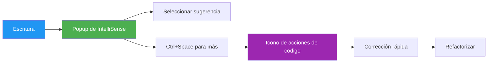
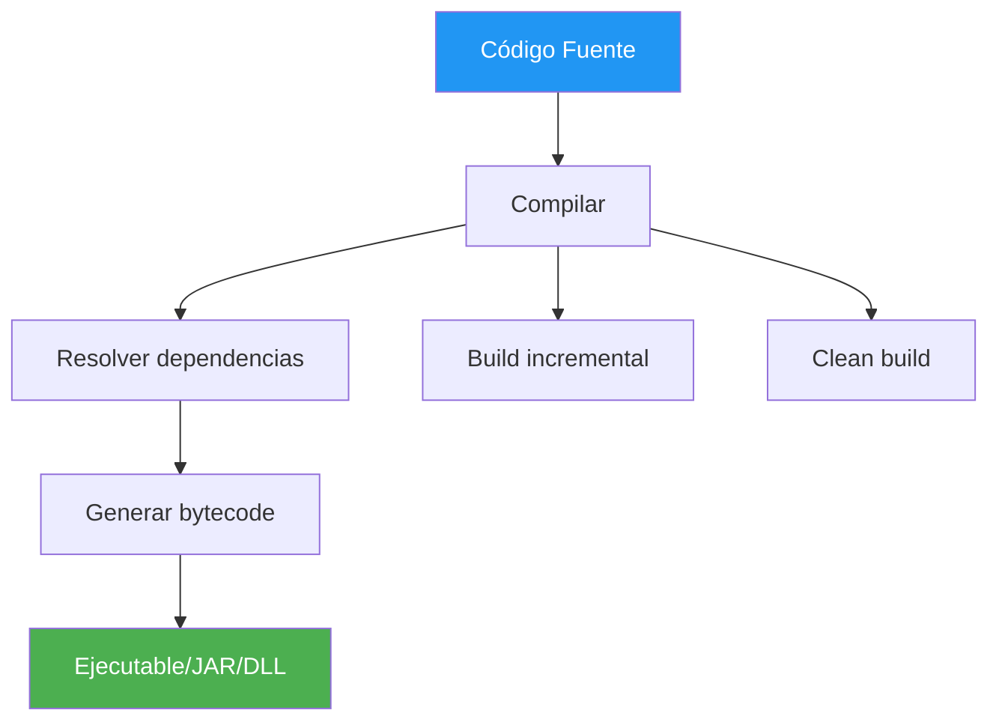
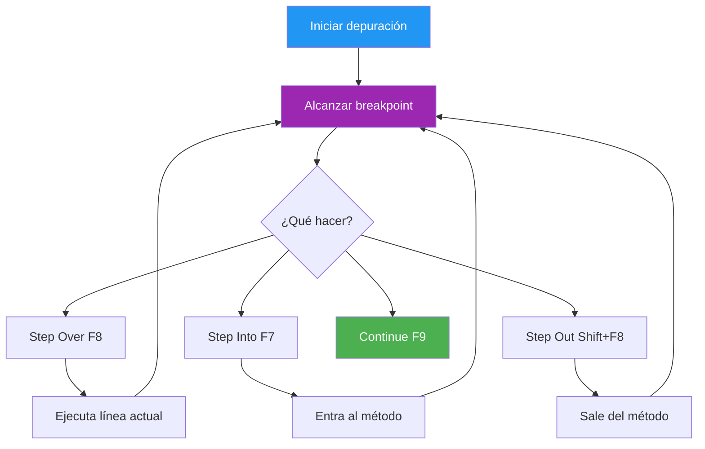

- [5. Operativa Básica del IDE](#5-operativa-básica-del-ide)
  - [5.1. Edición Asistida y Refactorización](#51-edición-asistida-y-refactorización)
    - [5.1.1. Edición Asistida (IntelliSense y Sugerencias)](#511-edición-asistida-intellisense-y-sugerencias)
    - [5.1.2. Funciones Avanzadas de Edición (VS Code)](#512-funciones-avanzadas-de-edición-vs-code)
    - [5.1.3. Refactorización (Operativa JetBrains)](#513-refactorización-operativa-jetbrains)
  - [5.2. Generación de Ejecutables (Build)](#52-generación-de-ejecutables-build)
  - [5.3. Depuración (Debugging)](#53-depuración-debugging)
  - [5.4. Integración de Control de Versiones](#54-integración-de-control-de-versiones)
      - [5.4.1. Visual Studio Code (VS Code)](#541-visual-studio-code-vs-code)
      - [5.4.2. IntelliJ IDEA y JetBrains Rider](#542-intellij-idea-y-jetbrains-rider)


# 5. Operativa Básica del IDE

> 💡 **Punto de partida:** Tienes el IDE instalado y personalizado. Ahora viene lo importante: ¿cómo se usa para programar de verdad?

> 💡 **¿Por qué me importa?**
> La operativa básica es donde la teoría se convierte en práctica. Saber compilar, depurar y usar Git desde el IDE es lo que separa a un estudiante de un desarrollador profesional.
> 
> 🔗 **Conexión con otros puntos:** El Punto 03 viste la anatomía. Este punto la usas. El Punto 06 te dará los atajos para hacerlo todo más rápido.

En el Punto 04 personalizaste tu entorno. Ahora veremos la operativa básica: cómo usar el IDE para programar de verdad, compilar, depurar y gestionar el código.

**Objetivos de aprendizaje:**

- Usar el editor con autocompletado e IntelliSense
- Compilar y ejecutar proyectos desde el IDE
- Depurar código con breakpoints y ejecución paso a paso
- Gestionar el control de versiones Git desde el IDE
- Generar ejecutables a partir de código fuente

## 5.1. Edición Asistida y Refactorización

### 5.1.1. Edición Asistida (IntelliSense y Sugerencias)

- **IntelliSense (VS Code):** Las sugerencias aparecerán al escribir. Se pueden navegar usando las teclas `Up` y `Down`, y se aceptan con `Tab` o `Enter`. Se puede activar manualmente con **Ctrl+Space**.

> 💡 **Tip:** IntelliSense funciona mejor si el archivo está bien formado. Errores de sintaxis previos pueden afectar las sugerencias.

- **Soporte CamelCase:** El filtrado de sugerencias soporta *CamelCase*, permitiendo teclear solo las letras en mayúscula de un nombre de método para limitar las sugerencias (ej. "cra" para "createApplication").

> 📝 **Ejemplo CamelCase:**
> ```csharp
> // Escribes "cra" y IntelliSense sugiere:
> CreateApplication()
> CreateArray()
> // Porque "C" de Create, "r" de Application, "a" de Application
> ```

- **Code Actions (VS Code):** El icono del "bombillo" (*lightbulb icon*) indica sugerencias de corrección rápida o refactorizaciones. Se accede mediante **Ctrl+Space**.



### 5.1.2. Funciones Avanzadas de Edición (VS Code)

- **Búsqueda y Reemplazo:** **Ctrl+F** abre el control de Búsqueda y Reemplazo en el archivo actual. **Ctrl+Shift+F** permite buscar y reemplazar globalmente a través de todos los archivos del *workspace*.

| Atajo | Función | Alcance |
|-------|---------|---------|
| `Ctrl + F` | Buscar | Archivo actual |
| `Ctrl + H` | Reemplazar | Archivo actual |
| `Ctrl + Shift + F` | Buscar | Proyecto completo |
| `Ctrl + Shift + H` | Reemplazar | Proyecto completo |

- **Selección por Columna (*Box Selection*):** Se realiza colocando el cursor en una esquina y arrastrando mientras se mantiene pulsado **Shift+Alt**.

> 💡 **Ejemplo práctico:** Añadir `//` a múltiples líneas simultáneamente
> ```
> línea 1
> línea 2
> línea 3
>     ↓ Con box selection
> // línea 1
> // línea 2
> // línea 3
> ```

- **Controles de Formato:** VS Code tiene soporte para formatear código:

| Atajo | Función |
|-------|---------|
| `Shift + Alt + F` | Format Document (todo el archivo) |
| `Ctrl + K Ctrl + F` | Format Selection (solo selección) |

**Configuraciones de formato automático:**
```json
{
    "editor.formatOnType": true,
    "editor.formatOnSave": true,
    "editor.formatOnPaste": true,
    "editor.defaultFormatter": "esbenp.prettier-vscode"
}
```

- **Plegado (*Folding*):** Se pueden plegar regiones de código usando los iconos en el *gutter*. Se puede plegar la región más interna no colapsada en el cursor con **Ctrl+Shift+[** (Windows/Linux).

| Atajo | Función |
|-------|---------|
| `Ctrl + Shift + [` | Plegar región |
| `Ctrl + Shift + ]` | Desplegar región |
| `Ctrl + K Ctrl + 0` | Plegar todo |
| `Ctrl + K Ctrl + J` | Desplegar todo |

### 5.1.3. Refactorización (Operativa JetBrains)

La refactorización se invoca con **Ctrl+Alt+Shift+T**.

> 📝 **Acceso rápido:** Haz clic derecho en el código → "Refactor" o usa el atajo directo si lo conoces.

- **Tipos de Refactorización (Rider / IntelliJ IDEA):** Se soportan acciones como:

| Atajo | Refactorización | Descripción |
|-------|-----------------|-------------|
| `Shift + F6` | Rename | Renombrar variable/símbolo |
| `Alt + Delete` | Safe Delete | Eliminar sin romper referencias |
| `Ctrl + Alt + M` | Extract Method | Crear método desde código |
| `Ctrl + F6` | Change Signature | Modificar firma del método |
| `Ctrl + Alt + V` | Extract Variable | Crear variable desde expresión |
| `Ctrl + Alt + C` | Extract Constant | Crear constante |
| `Ctrl + Alt + P` | Extract Parameter | Crear parámetro |

> 💡 **Ejemplo Extract Method:**
> ```csharp
> // Antes
> double area1 = Math.PI * radius1 * radius1;
> double area2 = Math.PI * radius2 * radius2;
> 
> // Después de Extract Method
> double area1 = CalculateArea(radius1);
> double area2 = CalculateArea(radius2);
> 
> private static double CalculateArea(double radius) {
>     return Math.PI * radius * radius;
> }
> ```

- **Previsualización:** Rider permite **previsualizar los cambios** antes de aplicarlos en el diálogo *Refactoring Preview*.

> 📝 **Importante:** Siempre usa la previsualización antes de refactorizaciones grandes. Así puedes ver qué archivos serán afectados.

- **Deshacer:** Se puede **deshacer la refactorización** con **Ctrl+Z**.

## 5.2. Generación de Ejecutables (Build)

El proceso de **Construcción (*Build*)** implica compilar y enlazar el código.



**5.2.1. Métodos de Construcción (Rider / IntelliJ IDEA)**

- **Recompilar Archivo Único:** **Build | Recompile** (`Ctrl+Shift+F9`).

- **Construcción Incremental (*Build*):** Compila todas las clases dentro del objetivo y solo las clases que han cambiado, además de sus dependencias. Se ejecuta con **Build | Build Project** (`Ctrl+F9`). Rider usa `dotnet build` internamente para proyectos .NET.

> 💡 **Build incremental vs Clean:**
> - **Incremental:** Solo recompila lo que cambió (segundos)
> - **Clean:** Borra todo y recompila desde cero (minutos)

- **Reconstrucción (*Rebuild*):** Limpia el directorio de salida, elimina las cachés y construye el proyecto **desde cero**. Es útil si el *classpath* ha cambiado (ej. se añadieron/eliminaron SDKs). Se ejecuta con `Build | Rebuild Project`.

- **Compilación Automática (*Auto-build*):** Se puede configurar en `Settings | Build, Execution, Deployment | Compiler` seleccionando **Build project automatically**.

### Diferencia entre Build, Rebuild y Clean

| Comando | Qué hace | Cuándo usarlo |
|---------|----------|---------------|
| **Build** | Compila solo archivos modificados y sus dependencias | Uso diario (rápido) |
| **Rebuild** | Limpia todo y compila desde cero | Después de cambiar dependencias o SDK |
| **Clean** | Elimina archivos compilados (carpeta bin/obj) sin recompilar | Antes de un Build completo |

**En .NET CLI:**
```bash
dotnet build      # Build incremental
dotnet clean      # Clean (elimina bin/obj)
dotnet build      # Tras clean, recompila todo
```

**En JetBrains:**
- `Build → Build Project` (`Ctrl+F9`) = Build incremental
- `Build → Rebuild Project` = Limpia + compila todo
- `Build → Clean Project` = Solo elimina archivos compilados

**5.2.2. Empaquetado de Artefactos (Rider / IntelliJ IDEA)**

Un archivo JAR (*Java archive*) compilado es llamado un **artefacto**. Para crearlo:

1. Ir a **`File | Project Structure`** (`Ctrl+Alt+Shift+S`) y seleccionar **Artifacts**.
2. Clic en `+` → **JAR** → **From modules with dependencies**.
3. Seleccionar la clase principal (*Main Class*).
4. Para construirlo, ir a **`Build | Build Artifacts`** → **Build**. El archivo `.jar` se alojará en la carpeta `out/artifacts`.
5. **Añadir Archivos:** Se pueden añadir archivos adicionales (imágenes, configuraciones, otros JARs) al artefacto a través de la sección *Output Layout* en el diálogo *Artifacts*.

> 💡 **Ejecutar el JAR:**
> ```bash
> java -jar miaplicacion.jar
> ```

**5.2.3. Generación de Ejecutables con Varios IDEs (CCEE f)**

Un mismo código fuente puede compilarse con diferentes entornos de desarrollo, generando ejecutables equivalentes. Esto demuestra que la elección del IDE no afecta al resultado final del programa.

**Ejemplo práctico: "Hola Mundo" en C# con diferentes IDEs:**

| IDE | Herramienta de Build | Comando | Resultado |
|-----|---------------------|---------|-----------|
| **JetBrains Rider** | Build button / `Ctrl+F9` | `dotnet build` | `MiApp.dll` |
| **VS Code** | Terminal integrada | `dotnet build` | `MiApp.dll` |
| **Visual Studio** | Build menu / `Ctrl+Shift+B` | `msbuild` | `MiApp.exe` |
| **Línea de comandos** | Terminal del sistema | `dotnet publish` | `MiApp.exe` (autocontenido) |

> 📝 **Nota:** El resultado es el mismo (un ejecutable .NET) independientemente del IDE usado. La diferencia está en las herramientas auxiliares: depurador, autocompletado, refactorización, etc.

**Ejemplo con Java:**

| IDE | Herramienta | Comando | Resultado |
|-----|-------------|---------|-----------|
| **IntelliJ IDEA** | Build menu / `Ctrl+F9` | `javac` + `jar` | `MiApp.jar` |
| **VS Code** | Terminal + Extension Pack | `javac` + `jar` | `MiApp.jar` |
| **Eclipse** | Build menu | `javac` + `jar` | `MiApp.jar` |

> 💡 **Consejo:** Practica compilar el mismo proyecto con al menos 2 IDEs diferentes. Así entenderás que el IDE es solo una herramienta: el código fuente es el que importa.

## 5.3. Depuración (Debugging)

El depurador (*debugger*) interfiere con la ejecución para obtener información sobre el estado del programa y facilitar la detección y corrección de *bugs*.

> 📌 **Ejemplo real:** Cuando un servicio de Spotify falla en producción, los desarrolladores usan breakpoints y depuración remota para inspectar el estado de la aplicación en tiempo real, encontrando el error sin necesidad de añadir logs por todo el código.

> 💡 **Frase célebre:** "Si debuguear es el proceso de eliminar bugs, entonces programar es el proceso de ponerlos." - Edsger Dijkstra

**5.3.1. Puntos de Ruptura (*Breakpoints*)**

- Son marcadores que indican al depurador que debe **detener la ejecución** (*suspender*) del programa.
- **Establecimiento:** En **Rider**, se establece un punto de ruptura pulsando en el margen (*Gutter*) junto al número de línea; la línea queda resaltada en color rojo. En **VS Code**, se establece un *breakpoint* presionando **F9**.

| Tipo de breakpoint | Uso |
|-------------------|-----|
| **Line** | Detener en línea específica |
| **Conditional** | Detener si se cumple condición |
| **Exception** | Detener cuando lanza excepción |
| **Logpoint** | Escribir log sin detener |

**5.3.2. Ejecución Controlada y Comandos**

El depurador se utiliza para controlar la ejecución paso a paso.

| Comando | Atajo (IntelliJ) | Atajo (VS Code) | Función Principal |
| :------ | :--------------- | :-------------- | :---------------- |
| **Step Over** | `F8` | `F10` | Ejecuta línea, no entra en métodos |
| **Step Into** | `F7` | `F11` | Entra dentro del método |
| **Step Out** | `Shift + F8` | `Shift + F11` | Sale del método actual |
| **Continue** | `F9` | `F5` | Continúa hasta siguiente breakpoint |
| **Evaluate** | `Alt + F8` | - | Evalúa expresión |
| **Stop** | `Ctrl + F2` | `Shift + F5` | Termina depuración |



**5.3.3. Ventana de Variables Locales**

- Esta ventana muestra el **nombre, tipo y valor actual** de las variables durante la suspensión.
- El depurador permite **cambiar el valor de una variable local** en esta ventana y continuar la ejecución con el nuevo valor.

> 💡 **Truco de depuración:**
> ```csharp
> // Durante debug, puedes cambiar:
> contador = 100;  // Para probar caso límite
> nombre = "TEST"; // Para verificar lógica
> ```

## 5.4. Integración de Control de Versiones

#### 5.4.1. Visual Studio Code (VS Code)

- VS Code incluye **Source Control Management (SCM) integrado** y soporta Git *out-of-the-box*.

> 📝 **Acceso:** `Ctrl+Shift+G` abre el panel de control de versiones.

- **Operaciones:** La vista de **Source Control** se abre desde la *Activity Bar*. Permite inicializar un repositorio, **preparar cambios** (*stage*) y realizar **confirmaciones** (*commits*).


**Atajos Git VS Code:**

| Atajo | Función |
|-------|---------|
| `Ctrl + G` | Source Control |
| `Ctrl + Enter` | Commit |
| `Ctrl + Shift + P` → "git push" | Push |
| `Ctrl + Shift + P` → "git pull" | Pull |

#### 5.4.2. JetBrains Rider y IntelliJ IDEA

- **VCS Widget:** En los IDEs JetBrains, existe un *VCS widget* en la barra de herramientas que muestra la **rama actual** y ofrece acciones como actualizar, confirmar y empujar cambios.

| Atajo | Función |
|-------|---------|
| `Ctrl + K` | Commit |
| `Ctrl + T` | Update |
| `Ctrl + Shift + K` | Push |
| `Alt + BackQuote` | VCS Quick Popup |

- **Historial Local (*Local History*):** Herramienta útil en Rider que muestra las distintas versiones guardadas, destacando visualmente en **color verde** los cambios que ha sufrido el código en cada versión seleccionada.

> 💡 **Local History vs Git:**
> - **Local History:** Automático, guardado frecuente, solo local
> - **Git:** Manual, historial permanente, compartible
>
> Usa Local History para recover cambios no-committed. Usa Git para control de versiones real.

---

**Resumen del punto:**

| Concepto | Descripción |
|----------|-------------|
| **IntelliSense** | Autocompletado inteligente con sugerencias |
| **Build** | Compilación incremental (solo cambia lo modificado) |
| **Rebuild** | Recompilación completa desde cero |
| **Breakpoints** | Puntos de ruptura para detener la ejecución |
| **Step Over/Into/Out** | Ejecución paso a paso en depuración |
| **Git integrado** | Commit, push, pull desde el IDE |
| **JAR/NuGet** | Empaquetado de artefactos y gestión de dependencias |

En el siguiente punto encontrarás los atajos de teclado esenciales para ejecutar todo esto más rápido y ser más productivo.
