- [7. Resumen y Conclusiones](#7-resumen-y-conclusiones)
  - [7.1. Mapa Conceptual de la Unidad](#71-mapa-conceptual-de-la-unidad)
  - [7.2. Conceptos Clave](#72-conceptos-clave)
    - [Entorno de Desarrollo Integrado (IDE)](#entorno-de-desarrollo-integrado-ide)
    - [Herramientas Fundamentales](#herramientas-fundamentales)
    - [Anatomía del IDE](#anatomía-del-ide)
    - [Personalización](#personalización)
    - [Operativa Básica](#operativa-básica)
  - [7.3. Comparativa de IDEs](#73-comparativa-de-ides)
  - [7.4. Checklist de Supervivencia](#74-checklist-de-supervivencia)

> 💡 **Punto de partida:** Hemos recorrido todo el camino desde qué es un IDE hasta cómo usarlo como un profesional. Este resumen consolida todo lo aprendido.

> 💡 **¿Por qué me importa?**
> Este resumen es tu guía de referencia rápida. Antes de un examen o de empezar un proyecto, revisa este punto para asegurarte de que dominas todos los conceptos.

> 🔗 **Conexión con la unidad:** Todos los puntos anteriores convergen aquí. El IDE es la herramienta que usarás cada día como desarrollador DAW.

# 7. Resumen y Conclusiones

## 7.1. Mapa Conceptual de la Unidad

```mermaid
graph TD
    UD02[UD02: Entornos de Desarrollo] --> IDE[Concepto de IDE]
    UD02 --> HERR[Instalación de Herramientas]
    UD02 --> ANAT[Anatomía del IDE]
    UD02 --> CONF[Configuración]
    UD02 --> OPER[Operativa Básica]
    UD02 --> ATAJ[Atajos de Teclado]

    IDE --> IDE1[Editor de código]
    IDE --> IDE2[Compilador/Intérprete]
    IDE --> IDE3[Depurador]
    IDE --> IDE4[Control de Versiones]
    IDE --> IDE5[Gestión de proyectos]
    IDE --> IDE6[Terminal]
    IDE --> IDE7[Refactorización]

    HERR --> HERR1[JDK 25]
    HERR --> HERR2[.NET 10]
    HERR --> HERR3[Rider]
    HERR --> HERR4[IntelliJ IDEA]
    HERR --> HERR5[VS Code]
    HERR --> HERR6[Git]
    HERR --> HERR7[GitKraken]

    ANAT --> ANAT1[JetBrains UI]
    ANAT --> ANAT2[Tool Windows]
    ANAT --> ANAT3[VS Code Layout]

    CONF --> CONF1[Plugins/Extensiones]
    CONF --> CONF2[Personalización]
    CONF --> CONF3[Themes y Fonts]
    CONF --> CONF4[Actualizaciones]

    OPER --> OPER1[Edición asistida]
    OPER --> OPER2[Build/Compilación]
    OPER --> OPER3[Debugging]
    OPER --> OPER4[Git integration]

    ATAJ --> ATAJ1[Rider]
    ATAJ --> ATAJ2[IntelliJ IDEA]
    ATAJ --> ATAJ3[VS Code]

    style UD02 fill:#2196F3,color:#fff
```

## 7.2. Conceptos Clave

### Entorno de Desarrollo Integrado (IDE)
- **Definición:** Aplicación que agrupa editor, compilador, depurador y herramientas de gestión
- **Componentes esenciales:** Editor, compilador/intérprete, depurador, control de versiones
- **IDEs del curso:** JetBrains Rider, IntelliJ IDEA, VS Code

### Herramientas Fundamentales
| Herramienta | Función | Comando clave |
|-------------|---------|---------------|
| **JDK 25** | Desarrollo Java | `javac`, `java` |
| **.NET 10** | Desarrollo C# | `dotnet` |
| **Git** | Control de versiones | `git commit`, `git push` |
| **GitKraken** | Cliente Git visual | UI gráfica |

### Anatomía del IDE

**JetBrains (Rider/IntelliJ):**
- Tool Windows (`Alt+1` a `Alt+12`)
- Gutter (números, breakpoints, acciones)
- Status Bar (línea, encoding, branch)
- Widgets en toolbar (Project, VCS, Run)

**VS Code:**
- Activity Bar (vistas laterales)
- Command Palette (`Ctrl+Shift+P`)
- Terminal integrada (`` Ctrl+` ``)
- Multi-cursor y fuzzy search

### Personalización
- **Plugins/Extensiones:** Modularidad y funcionalidades adicionales
- **Temas:** Light/Dark/Darcula
- **Fuentes:** JetBrains Mono, Fira Code con ligaduras
- **Atajos:** Personalizables en Settings

### Operativa Básica
- **Edición asistida:** IntelliSense, autocompletado, Code Actions
- **Build:** Compilación incremental vs clean rebuild
- **Debugging:** Breakpoints, Step Over/Into/Out, variables
- **Git:** Commit, push, pull, branch, merge

## 7.3. Comparativa de IDEs

| Aspecto | Rider | IntelliJ IDEA | VS Code |
|---------|--------------|-------|---------|
| **Licencia** | Comercial (~$149/año estudiantes, gratis con Student Pack) | Community (gratis) / Ultimate (trial) | Free (MIT) |
| **Peso** | Pesado (~500MB) | Pesado | Ligero (~100MB) |
| **Java** | ⭐⭐⭐ | ⭐⭐⭐⭐⭐ | ⭐⭐⭐ |
| **.NET** | ⭐⭐⭐⭐⭐ | ⭐⭐⭐ | ⭐⭐⭐ |
| **Web/JS** | ⭐⭐⭐ | ⭐⭐⭐ | ⭐⭐⭐⭐⭐ |
| **Extensible** | ⭐⭐⭐ | ⭐⭐⭐ | ⭐⭐⭐⭐⭐ |
| **Startup** | Lento | Lento | Rápido |
| **Configuración** | Compleja | Compleja | Simple (JSON) |

---

## 7.4. Checklist de Supervivencia

Antes de dar por cerrado el tema, asegúrate de poder responder **SÍ** a estas preguntas:

- [ ] ¿Conozco los componentes esenciales de un IDE?
- [ ] ¿Sé instalar JDK 25 y configurar el PATH?
- [ ] ¿Puedo instalar y configurar JetBrains Rider, IntelliJ IDEA y VS Code?
- [ ] ¿Sé qué son los plugins y cómo instalarlos?
- [ ] ¿Puedo personalizar temas, fuentes y atajos?
- [ ] ¿Sé usar el editor con autocompletado e IntelliSense?
- [ ] ¿Puedo compilar y ejecutar un proyecto desde el IDE?
- [ ] ¿Sé usar breakpoints y ejecutar paso a paso en debug?
- [ ] ¿Puedo usar Git integrado para commit y push?
- [ ] ¿He memorizado al menos 10 atajos de teclado esenciales?
- [ ] ¿Entiendo la diferencia entre Build y Rebuild?
- [ ] ¿Sé crear un nuevo proyecto, configurar su estructura y crear un ejecutable?
- [ ] ¿Puedo comparar IDEs y elegir el más adecuado según el lenguaje y proyecto?
- [ ] ¿Puedo crear un proyecto, compilarlo, depurarlo desde la consola con su CLI y desde el IDE?
