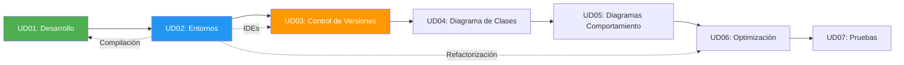

- [7. Resumen y Conclusiones](#7-resumen-y-conclusiones)
  - [7.1. Mapa Conceptual de la Unidad](#71-mapa-conceptual-de-la-unidad)
  - [7.2. Conceptos Clave](#72-conceptos-clave)
    - [Entorno de Desarrollo Integrado (IDE)](#entorno-de-desarrollo-integrado-ide)
    - [Herramientas Fundamentales](#herramientas-fundamentales)
    - [Anatomía del IDE](#anatomía-del-ide)
    - [Personalización](#personalización)
    - [Operativa Básica](#operativa-básica)
  - [7.3. Comparativa de IDEs](#73-comparativa-de-ides)
  - [7.4. Errores Comunes a Evitar](#74-errores-comunes-a-evitar)
  - [7.5. Checklist de Supervivencia](#75-checklist-de-supervivencia)
  - [7.5. Glosario de Términos](#76-glosario-de-términos)
  - [7.6. Ejercicios de Repaso](#77-ejercicios-de-repaso)
  - [7.7. ¿Qué viene después?](#78-qué-viene-después)
  - [7.8. Mapa de Conexiones entre Temas](#79-mapa-de-conexiones-entre-temas)

> 💡 **Punto de partida:** Hemos recorrido todo el camino desde qué es un IDE hasta cómo usarlo como un profesional. Este resumen consolida todo lo aprendido.

> 💡 **¿Por qué me importa?**
> Este resumen es tu guía de referencia rápida. Antes de un examen o de empezar un proyecto, revisa este punto para asegurarte de que dominas todos los conceptos.

> 🔗 **Conexión con la unidad:** Todos los puntos anteriores convergen aquí. El IDE es la herramienta que usarás cada día como desarrollador DAW.

# 7. Resumen y Conclusiones

## 7.1. Mapa Conceptual de la Unidad

```mermaid
graph TD
    UD02[UD02: Entornos de Desarrollo] --> IDE[Concepto de IDE]
    UD02 --> HERR[Instalación de Herramientas]
    UD02 --> ANAT[Anatomía del IDE]
    UD02 --> CONF[Configuración]
    UD02 --> OPER[Operativa Básica]
    UD02 --> ATAJ[Atajos de Teclado]

    IDE --> IDE1[Editor de código]
    IDE --> IDE2[Compilador]
    IDE --> IDE3[Depurador]
    IDE --> IDE4[Control de versiones]
    IDE --> IDE5[Gestión de proyectos]
    IDE --> IDE6[Terminal integrada]
    IDE --> IDE7[Refactorización]
    IDE --> IDE8[IntelliSense/Autocompletado]

    HERR --> HERR1[JDK 25 — Java]
    HERR --> HERR2[.NET 10 SDK — C#]
    HERR --> HERR3[JetBrains Rider — IDE principal]
    HERR --> HERR4[IntelliJ IDEA — IDE secundario]
    HERR --> HERR5[VS Code — Editor extensible]
    HERR --> HERR6[Git — Control de versiones]
    HERR --> HERR7[GitKraken — Cliente visual]
    HERR --> HERR8[Oh My Posh — Terminal]

    ANAT --> ANAT1[JetBrains: Tool Windows, Gutter, Status Bar]
    ANAT --> ANAT2[VS Code: Activity Bar, Editor, Panel]
    ANAT --> ANAT3[Filosofía de uniformidad]

    CONF --> CONF1[Plugins y extensiones]
    CONF --> CONF2[Temas y fuentes]
    CONF --> CONF3[Atajos personalizados]
    CONF --> CONF4[Dotfiles y sincronización]
    CONF --> CONF5[Sistema de actualizaciones]

    OPER --> OPER1[Edición asistida]
    OPER --> OPER2[Build vs Rebuild vs Clean]
    OPER --> OPER3[Debugging: breakpoints, Step]
    OPER --> OPER4[Refactorización]
    OPER --> OPER5[Git integrado]

    ATAJ --> ATAJ1[Rider / IntelliJ — Ctrl+Shift+A]
    ATAJ --> ATAJ2[VS Code — Ctrl+Shift+P]
    ATAJ --> ATAJ3[Progresión: básico → intermedio → avanzado]

    style UD02 fill:#2196F3,color:#fff
    style IDE fill:#4CAF50,color:#fff
    style HERR fill:#FF9800,color:#fff
    style ANAT fill:#9C27B0,color:#fff
    style CONF fill:#f44336,color:#fff
    style OPER fill:#00BCD4,color:#fff
    style ATAJ fill:#795548,color:#fff
```

## 7.2. Conceptos Clave

### Entorno de Desarrollo Integrado (IDE)
- **Definición:** Aplicación que agrupa editor, compilador, depurador y herramientas de gestión
- **Componentes esenciales:** Editor, compilador/intérprete, depurador, control de versiones
- **IDEs del curso:** JetBrains Rider, IntelliJ IDEA, VS Code

### Herramientas Fundamentales
| Herramienta | Función | Comando clave |
|-------------|---------|---------------|
| **JDK 25** | Desarrollo Java | `javac`, `java` |
| **.NET 10** | Desarrollo C# | `dotnet` |
| **Git** | Control de versiones | `git commit`, `git push` |
| **GitKraken** | Cliente Git visual | UI gráfica |

### Anatomía del IDE

**JetBrains (Rider/IntelliJ):**
- Tool Windows (`Alt+1` a `Alt+12`)
- Gutter (números, breakpoints, acciones)
- Status Bar (línea, encoding, branch)
- Widgets en toolbar (Project, VCS, Run)

**VS Code:**
- Activity Bar (vistas laterales)
- Command Palette (`Ctrl+Shift+P`)
- Terminal integrada (`` Ctrl+` ``)
- Multi-cursor y fuzzy search

### Personalización
- **Plugins/Extensiones:** Modularidad y funcionalidades adicionales
- **Temas:** Light/Dark/Darcula
- **Fuentes:** JetBrains Mono, Fira Code con ligaduras
- **Atajos:** Personalizables en Settings

### Operativa Básica
- **Edición asistida:** IntelliSense, autocompletado, Code Actions
- **Build:** Compilación incremental vs clean rebuild
- **Debugging:** Breakpoints, Step Over/Into/Out, variables
- **Git:** Commit, push, pull, branch, merge

## 7.3. Comparativa de IDEs

| Aspecto | Rider | IntelliJ IDEA | VS Code |
|---------|--------------|-------|---------|
| **Licencia** | Comercial (~$149/año estudiantes, gratis con Student Pack) | Community (gratis) / Ultimate (trial) | Free (MIT) |
| **Peso** | Pesado (~500MB) | Pesado | Ligero (~100MB) |
| **Java** | ⭐⭐⭐ | ⭐⭐⭐⭐⭐ | ⭐⭐⭐ |
| **.NET** | ⭐⭐⭐⭐⭐ | ⭐⭐⭐ | ⭐⭐⭐ |
| **Web/JS** | ⭐⭐⭐ | ⭐⭐⭐ | ⭐⭐⭐⭐⭐ |
| **Extensible** | ⭐⭐⭐ | ⭐⭐⭐ | ⭐⭐⭐⭐⭐ |
| **Startup** | Lento | Lento | Rápido |
| **Configuración** | Compleja | Compleja | Simple (JSON) |

---

## 7.4. Errores Comunes a Evitar

| Error | Por qué está mal | Cómo evitarlo |
|-------|------------------|---------------|
| No instalar el SDK (JDK/.NET) | El IDE no puede compilar sin el SDK | Siempre instalar el SDK ANTES del IDE |
| Confundir Build y Rebuild | Build es incremental, Rebuild limpia todo | Usar Build normalmente, Rebuild solo si hay problemas de dependencias |
| No usar breakpoints | Depurar con `Console.WriteLine` es lento y sucio | Aprender a usar breakpoints y Step Over/Into |
| Instalar demasiados plugins | Ralentizan el IDE significativamente | Instalar solo los que uses diariamente |
| No sincronizar configuración | Pierdes tu entorno al cambiar de máquina | Usar Settings Sync (VS Code) o Settings Repository (JetBrains) |
| Ignorar las actualizaciones | Te pierdes correcciones de bugs y seguridad | Configurar actualizaciones automáticas en canal Stable |
| Usar `Parse` sin `TryParse` | Excepción si el usuario no introduce un número válido | Siempre `TryParse` con datos de usuario |
| No usar control de versiones | Pierdes código y no puedes colaborar | Git integrado en el IDE, hacer commit frecuente |
| Olvidar `.editorconfig` | Formato inconsistente en equipo | Crear `.editorconfig` en la raíz del proyecto |
| No conocer atajos básicos | Evas tiempo usando el ratón para todo | Memorizar los 10 atajos esenciales primero |

## 7.5. Checklist de Supervivencia

Antes de dar por cerrado el tema, asegúrate de poder responder **SÍ** a estas preguntas:

- [ ] ¿Conozco los componentes esenciales de un IDE?
- [ ] ¿Sé instalar JDK 25 y configurar el PATH?
- [ ] ¿Puedo instalar y configurar JetBrains Rider, IntelliJ IDEA y VS Code?
- [ ] ¿Sé qué son los plugins y cómo instalarlos?
- [ ] ¿Puedo personalizar temas, fuentes y atajos?
- [ ] ¿Sé usar el editor con autocompletado e IntelliSense?
- [ ] ¿Puedo compilar y ejecutar un proyecto desde el IDE?
- [ ] ¿Sé usar breakpoints y ejecutar paso a paso en debug?
- [ ] ¿Puedo usar Git integrado para commit y push?
- [ ] ¿He memorizado al menos 10 atajos de teclado esenciales?
- [ ] ¿Entiendo la diferencia entre Build y Rebuild?
- [ ] ¿Sé crear un nuevo proyecto, configurar su estructura y crear un ejecutable?
- [ ] ¿Puedo comparar IDEs y elegir el más adecuado según el lenguaje y proyecto?
- [ ] ¿Puedo crear un proyecto, compilarlo, depurarlo desde la consola con su CLI y desde el IDE?

## 7.6. Glosario de Términos

| Término | Definición |
|---------|------------|
| **IDE** | Entorno de Desarrollo Integrado: aplicación que agrupa editor, compilador y depurador |
| **Rider** | IDE de JetBrains para C#/.NET, multiplataforma |
| **IntelliJ IDEA** | IDE de JetBrains para Java/Kotlin |
| **VS Code** | Editor extensible de Microsoft, gratuito y open source |
| **Plugin/Extensión** | Módulo que añade funcionalidades al IDE |
| **Build** | Compilación incremental (solo archivos modificados) |
| **Rebuild** | Reconstrucción completa desde cero |
| **Clean** | Eliminación de archivos compilados sin recompilar |
| **Breakpoint** | Punto de ruptura para detener la ejecución en depuración |
| **Step Over** | Ejecutar línea sin entrar en métodos |
| **Step Into** | Ejecutar línea entrando en el método |
| **Step Out** | Salir del método actual |
| **Refactorización** | Mejorar código sin cambiar su comportamiento |
| **IntelliSense** | Sistema de autocompletado inteligente |
| **Dotfiles** | Archivos de configuración que empiezan por punto |
| **JDK** | Java Development Kit: plataforma para desarrollar en Java |
| **.NET SDK** | Kit de desarrollo para C#/.NET |
| **NuGet** | Gestor de paquetes de .NET |
| **Gradle** | Sistema de construcción para Java/Kotlin |
| **Top Level Statements** | Sintaxis C# sin clase Main explícita |
| **Main simplificado** | Sintaxis Java 25: `void main()` sin `public static` |

## 7.7. Ejercicios de Repaso

1. **Conceptos:** Explica con tus palabras qué es un IDE y por qué no basta con un editor de texto.
2. **Instalación:** Instala Rider, IntelliJ y VS Code. Configura el mismo tema en los tres.
3. **Anatomía:** Abre Rider y localiza: Gutter, Status Bar, Tool Windows, Terminal.
4. **Configuración:** Crea un snippet personalizado en VS Code y sincroniza tu configuración con Settings Sync.
5. **Compilación:** Crea un proyecto C# en Rider, compílalo con Build y luego con Rebuild. Explica la diferencia.
6. **Depuración:** Crea un proyecto con error lógico, usa breakpoints para encontrarlo.
7. **Atajos:** Sin usar el ratón, abre un archivo, compila, depura y formatea el código.
8. **Comparativa:** Evalúa Rider, IntelliJ y VS Code para un proyecto de Java. Justifica tu elección.

## 7.8. ¿Qué viene después?

En la siguiente unidad (**UD03: Sistema de Control de Versiones**) veremos en profundidad **Git**: ramas, merges, conflictos, flujos de trabajo y colaboración en equipo. Todo lo que aprendiste aquí sobre Git integrado en el IDE será la base para dominar el control de versiones.

## 7.9. Mapa de Conexiones entre Temas

